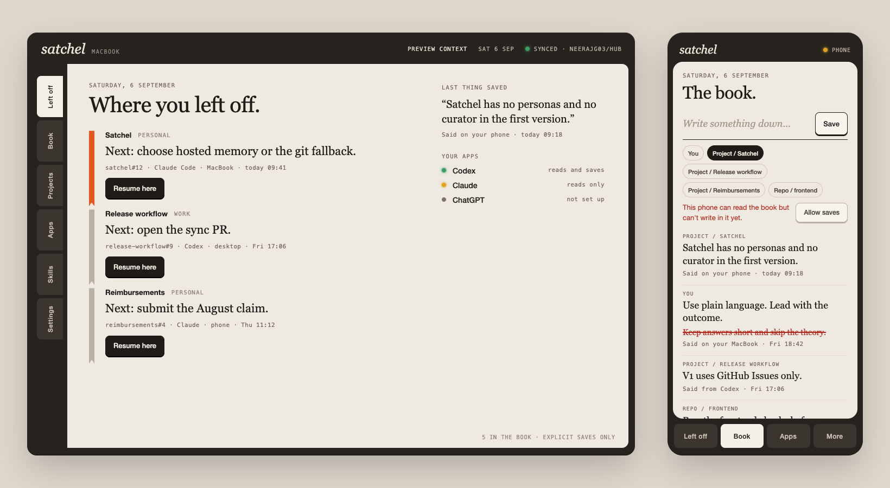

# Satchel design

The current direction is **a personal notebook with physical controls**. This folder preserves the visual work and its review, without treating sample interactions as settled product mechanisms.

## Start here

- [Visual direction](visual-direction.md): palette, typography options, material treatment, copy, and unresolved choices.
- [Screen map](screen-map.md): the purpose of each surface and what still needs product definition.
- [Review notes](review-notes.md): findings from the latest review and the user's clarification.
- [Interactive Satchel mockup](mockup/satchel-companion.html): open in a browser, then use “Play interactive artboard.”
- [Preview image](mockup/preview.png): the current Satchel mockup.
- [Main source](mockup/Main.dc.html), [direction board](mockup/Direction.dc.html), and [canvas layout](mockup/canvas.json).

`mockup/` is the active design copy. On 10 September 2026, its title, device headers, sample project references, and handoff branding were renamed from JEFF to Satchel. Layout and interaction behavior are unchanged. All records and installation examples remain sample data, not working service or package configuration.

## What is preserved

`prototype/` is an unchanged copy of the supplied Claude design bundle, including earlier artboards under `prototype/archive/`, shared style text, and browser scripts under `prototype/tests/`. Its visible product name remains JEFF as historical evidence. Use the active Satchel mockup above for testing; the [original assembled prototype](prototype/jeff-companion.html) and [original preview](prototype/preview.png) remain available for comparison.

`archive/early-codex-mockups/` contains the rejected forest and cobalt explorations. Their companion reports and screenshots are in the [document archive](../docs/archive/). They are historical references, not competing current directions.

The assembled HTML embeds the canvas runtime; opening `Main.dc.html` alone is not equivalent because the standalone support runtime is not included. Fonts are requested externally, so rendering without network access can use fallback fonts.

## Inspection and editing

The assembled HTML can be opened locally. For HTTP inspection of the current mockup, serve `design/mockup/` with a local static server and open `satchel-companion.html`. The historical test scripts expect `http://localhost:8765/jeff-companion.html` and contain an author-machine Playwright path. They require environment adjustments elsewhere and are not a portable test suite or integration certification.

The handoff describes rebuilding through Claude Design using the artboard sources. No reproducible build pipeline is included here, and this collection does not republish the original cloud artifact.

Broad visual changes should follow the user's requested process: research, make a concrete proposal, get it vetted, then apply it. Current work preserves the look and feel while documenting unresolved functionality. No new redesign is implied.
