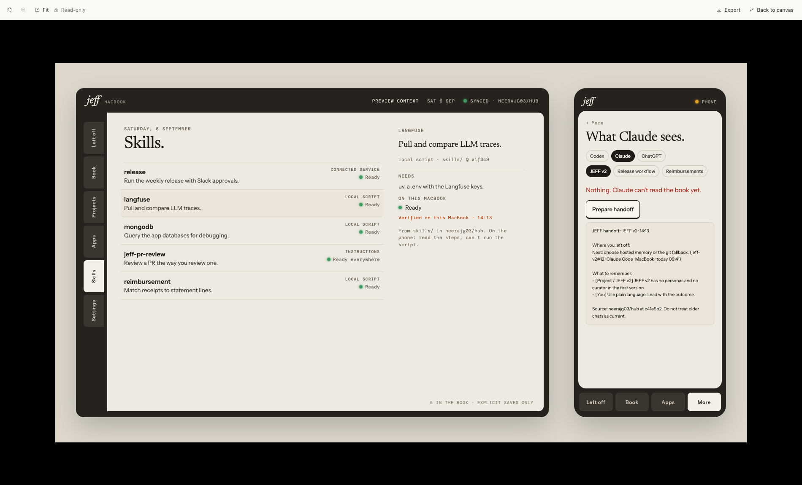

# Satchel design

The current direction is **a personal notebook with physical controls**. This folder preserves the visual work and its review, without treating sample interactions as settled product mechanisms.

## Start here

- [Visual direction](visual-direction.md): palette, typography options, material treatment, copy, and unresolved choices.
- [Screen map](screen-map.md): the purpose of each surface and what still needs product definition.
- [Review notes](review-notes.md): findings from the latest review and the user's clarification.
- [Assembled prototype](prototype/jeff-companion.html): open in a browser, then use “Play interactive artboard.”
- [Preview image](prototype/preview.png): the handoff's saved screenshot.
- [Main source](prototype/Main.dc.html), [direction board](prototype/Direction.dc.html), and [canvas layout](prototype/canvas.json).

## What is preserved

`prototype/` is an unchanged copy of the supplied Claude design bundle, including earlier artboards under `prototype/archive/`, shared style text, and browser scripts under `prototype/tests/`. The visible product name is still JEFF because these are source snapshots. Renaming every artboard or rewriting interactions was not part of this collection.

`archive/early-codex-mockups/` contains the rejected forest and cobalt explorations. Their companion reports and screenshots are in the [document archive](../docs/archive/). They are historical references, not competing current directions.

The assembled HTML embeds the canvas runtime; opening `Main.dc.html` alone is not equivalent because the standalone support runtime is not included. Fonts are requested externally, so rendering without network access can use fallback fonts.

## Inspection and editing

The supplied standalone HTML can be opened locally. For HTTP inspection, serve `design/prototype/` with a local static server and open `jeff-companion.html`. The historical test scripts expect `http://localhost:8765/jeff-companion.html` and contain an author-machine Playwright path. They require environment adjustments elsewhere and are not a portable test suite or integration certification.

The handoff describes rebuilding through Claude Design using the artboard sources. No reproducible build pipeline is included here, and this collection does not republish the original cloud artifact.

Broad visual changes should follow the user's requested process: research, make a concrete proposal, get it vetted, then apply it. Current work preserves the look and feel while documenting unresolved functionality. No new redesign is implied.
