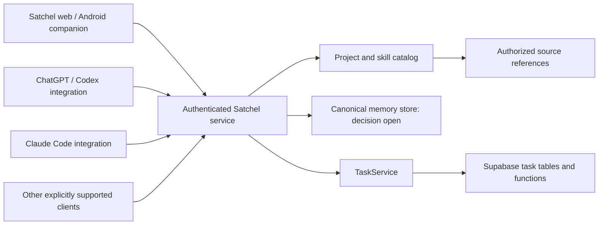

# Proposed architecture

8 September 2026. This is a conceptual boundary map, not an implementation plan or selected technology stack.

## Implemented companion structure — 17 September 2026

The pilot uses React/TypeScript with Vite, react-router and Supabase Auth/PostgreSQL. `src/main.tsx` mounts the router inside the auth provider. Routes, the shell and the features follow [design/screen-map.md](../design/screen-map.md):

| Module | Responsibility |
|---|---|
| `app/routes.tsx` | Route table. Every destination and detail page has a URL. Unknown routes go to `/`. |
| `app/auth.tsx` | Session state, GitHub sign-in and sign-out, return-to path for signed-out visits |
| `app/scope.ts` | The `?scope=me|project:<id>` query and its labels |
| `app/readout.tsx` | Footer readout and header status word, set per page with `useFooter` |
| `app/useLoad.ts` | Page loading, in-place error text, busy actions, conflict detection |
| `app/stores.ts` | One place that builds the four repositories from the signed-in client |
| `shell/*` | Hardware frame, header, rail, footer and the scope picker |
| `ui/*` | Buttons, chips, lights, fields, notices, segments, sheet, menu, provenance |
| `styles/*` | Tokens (copied from `design/tokens.css`), base, shell, components, pages |
| `features/memories/*` | Model, repository, Book page, composer and entry |
| `features/tasks/*` | Model, repository, list, capture, detail, edit, timeline, update composer, blocked sheet |
| `features/projects/*` | Repository, list, new-project sheet, project page, repository links |
| `features/connections/*` | Repository, Apps, Consent, Connected pages |
| `features/settings/Settings.tsx` | Account, export, forgetting |
| `request.mjs` | Bounded request execution shared by the repositories |
| `server/repository-hint-handler.mjs` | Validates and stages a short-lived repository identity without returning project or memory data |

The UI never builds database queries. Repositories receive their Supabase client explicitly. Adding another supported memory scope starts with the domain union and an intentional database migration; unknown scopes must not default to personal. Shared editor/list components remain independent of the storage representation. The current database boundary maps personal to a null project ID and project scope to a real project ID, with owner policies and separate uniqueness constraints enforcing the meaning.

Future agent transports must enforce their own connection grants against the same database authority. Do not reuse a companion session as agent authorization. There is no speculative source-plugin registry or generic entity framework in this structure; those systems remain deferred until concrete features require them.

## Intended shape

This is the user-facing direction expressed as a proposed architecture: one shared service, companion interfaces, and host-native integration packages. It does not require that every box be a separately deployed service. Start with a small deployable system and use existing infrastructure where it meets the needed behavior.

## Responsibilities

| Component | Owns | Does not imply |
|---|---|---|
| Hosted service | Identity, access checks, record operations, context assembly, catalog access, task adapter | A remote worker fleet or universal execution sandbox |
| Companion | Direct user interaction, configuration, inspection, correction, setup guidance, verification results | Control over every app's internal settings |
| Native integration package | Host-specific discovery, workflow instructions, service connection configuration | All private skills installed or supported on every device |
| Backing memory store | Canonical revisions and deletion/correction semantics | Independent copies in every native memory database |
| Supabase task store | Authoritative personal/project task records, planning graph and history | A repository requirement or external-tracker synchronization |
| Existing skill sources | Versioned reusable workflows | Satchel ownership of every third-party package |
| Native AI apps | Conversations, model selection, execution, workspace/session lifecycle | Guaranteed equivalent capabilities across their surfaces |

## Proposed request path

A connected host identifies its authorized session and the requested personal/project scope. The service checks effective access, retrieves current records and permitted source context, and returns a bounded result with IDs, provenance, revisions and derived task actionability. Live task operations go through Supabase functions behind `TaskService`; GitHub objects are optional HTTPS resources.

Writes need permission checks, idempotency, revision checks, and honest acknowledgement. Search indexes must be permission-aware and invalidated on relevant changes. Exact API schemas, tool names, search technology, and storage transaction mechanisms remain open.

The user's companion session is a separate caller from an agent connection. Do not tie the companion's ability to save to Claude's permission. The host remains responsible for its own tool approvals and execution policy; Satchel enforces its service-side access independently.

## Why a hosted service

The intended context loop should keep working when the home laptop is off. A laptop behind a tunnel can demonstrate a development connection but does not satisfy that product property. Deployment provider, region, operational cost, backup policy, and whether to offer self-hosting are unresolved.

Hosting and Git-backed storage can coexist: a hosted service could mediate authorized Git operations. A hosted database could also meet the logical record model. Choose based on write/correction semantics, access boundaries, retrieval, portability, retention, and actual phone behavior; do not choose solely because a mockup displays a commit hash.

## Reuse and limits

Use the platforms' own plugin distribution and authentication support. Do not implement a universal plugin installer or silently edit hidden native chat/memory stores. A host-native configuration/export path may be appropriate where verified.

Keep original documents in their source systems where appropriate. Linking an HTTPS source is different from implementing its connector. Supabase is the built-in task authority for V1; no GitHub or Notion synchronization adapter is implied by a link, archived document or independently installed skill.

A catalog and context service should stay useful without a large dashboard, automatic transcript collection, model routing, session orchestration, or background curation. Any later remote execution needs its own specification and evidence of need.

## Important unresolved implementation questions

1. Canonical memory and project storage, history, and export format.
2. Authentication, account linking, work/personal partitioning, and credential ownership.
3. Exact supported clients, account tiers/policies, and mobile setup paths.
4. Private skill distribution and evidence of installed/ready state.
5. Native versus responsive-web Android delivery and share-to-save behavior.
6. Context selection and refresh without assuming automatic retrieval.
7. Optional external-resource integrations, limits, concurrency, and failure recovery.
8. Deep links and handoff behavior that each destination actually supports.

These questions are not resolved by the current artifact. Use the [validation scenarios](migration-and-validation.md) to make the architecture concrete before declaring it ready to build at full scope.
