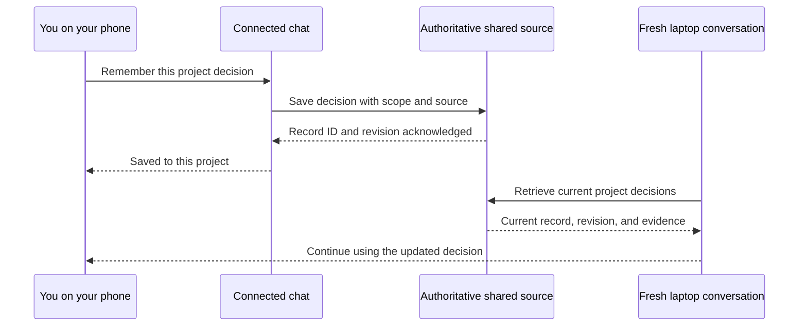

# Rethinking JEFF: continuity across AI conversations

**A detailed capability and migration report**  
Prepared for Neeraj · 5 September 2026  
Revised 5 September 2026: explicit memory saves, no curator, no personas.  
Status: design recommendation; no migration or external publishing performed.

## 1. The proposed purpose

**JEFF should help you carry useful knowledge and ongoing work between AI conversations, devices, and providers.**

The experience to aim for is simple: discuss a project on your phone, continue in a coding agent on your laptop, and have the important decisions, preferences, and next steps available without explaining everything again.

That changes what JEFF should own. Today, it organizes and runs agents. In the proposed design, existing applications run the agents, existing services hold tasks and files, and JEFF supplies only the missing continuity between them.

Two decisions now constrain this design: **there are no personas or persistent agent roles, and there is no curator in the initial system.** A connected session saves an explicit user instruction or confirmed decision directly to the authoritative source. There is no proposal queue, session-end memory extraction, scheduled consolidation, or automatic promotion of agent inferences. Useful knowledge formerly attached to an agent name moves into project/repository guidance, ordinary skills, or user preferences according to its meaning.

The initial audience is you across your own devices and accounts. Collaboration with other people is outside this pilot. Work and personal material still need separate access boundaries: one person's integrations do not automatically have permission to read everything that person can access elsewhere.

This report recommends three dispositions:

- **Preserve the content:** project knowledge, useful skills, decisions, task history, and reusable scripts.
- **Adopt existing infrastructure:** task trackers, Git repositories, skill installers, native agent sessions, and existing memory services where they pass practical tests.
- **Build only demonstrated gaps:** getting relevant information into a new conversation, saving corrections back to the right source, and making missing or stale context visible.

This is a proposed direction, not a claim that universal memory already works. The first release may be a collection of configurations and one small integration. A new database, dashboard, scheduler, or agent runtime is not a prerequisite.

### What “the same context” should mean

| Kind of continuity | Desired behavior | What is actually shared |
|---|---|---|
| Across devices | Continue work from a phone or another laptop | Remotely accessible project information and work state |
| Across new chats | Avoid repeating preferences and decisions | Relevant durable facts and instructions |
| Across providers | Use Claude, Codex, or another supported client | Provider-independent records and source links |
| Across time | Use the latest decision and explain earlier choices | Current records with history and supersession |

The target is **the same relevant, current knowledge**. It is not identical model behavior, identical tool access, or a transfer of an agent's hidden reasoning. A new conversation can reconstruct a useful working context; it cannot automatically inherit the full internal state of another model.

## 2. What was verified about your current JEFF

I inspected the installed CLI, its local source, the skill registry, project commands, and the memory implementation. The installed version reports `0.20.0-beta`; the inspected JEFF checkout is at `9a461fc`. CLI and source observations are identified separately where relevant; this is not a claim that every binary behavior was tested against that commit.

Your setup currently lists:

| Resource | Observed inventory |
|---|---|
| Registered codebases | 10, including frontend, Java backend, Python backend, infrastructure, API automation, knowledge base, JEFF, and gig |
| Projects | 10, covering engineering, reviews, interviews, notes, and reimbursements |
| Skills | 25 registered skills |
| Personas | 7: Dickson, Jenko, Schmidt, Eric, Hardy, Doug, and Marlowe |
| Canonical memory | 68 entries reported by `jeff memory status` |
| Pending memory | 99 proposals and 344 queued sessions reported by the same command |

The memory status command reports “Last curation: never,” but a first pass did run under `gig-16bd`. The [curator's saved finding](/Volumes/Casesensitive/jeff/memory/personas/marlowe/semantic/queue-slug-count-is-session-noise.md:15) records repeated emissions of the same slug. The [memory-correctness plan](/Volumes/Casesensitive/jeff/repos/jeff/roadmaps/PLAN-Memory-Correctness.md:15) documents a historical defect in which no production code wrote the status marker. However, [the current source does write it after a successful pass](/Volumes/Casesensitive/jeff/repos/jeff/memory/curate.go:169). It would be inaccurate to repeat “no production code writes it” as a present-source fact. The installed status alone cannot establish when curation last ran or why its marker is missing.

The installed gig reports `0.6.2`. The inspected source implements a transactional compare-and-swap claim in [task.go](/Volumes/Casesensitive/jeff/repos/gig/task.go:590), with [race tests](/Volumes/Casesensitive/jeff/repos/gig/claim_cas_test.go:10). Available binary build metadata did not identify its source revision, so this report does not claim that the installed binary either contains or lacks that fix. GitHub issue assignment is also not equivalent to an atomic claim.

Three implementation details affect the redesign:

1. **Projects are lightweight today.** `jeff project init` creates a directory and a `CLAUDE.md`; opening a project launches the configured agent there. There is no complicated project database to preserve. See [project implementation](/Volumes/Casesensitive/jeff/repos/jeff/cmd/jeff/project_cmd.go).
2. **Memory already contains useful structure.** The schema includes scope, source, validity dates, supersession, and verification metadata. Preserve these rather than flattening everything into a summary. See [memory schema](/Volumes/Casesensitive/jeff/repos/jeff/memory/frontmatter.go:25).
3. **JEFF takes ownership of some native memory.** Its code writes settings to suppress Claude Code and Gemini memory behavior. The new approach must explicitly revisit this; copying the current settings would preserve an architectural choice we are questioning. See [memory suppression](/Volumes/Casesensitive/jeff/repos/jeff/memory/suppress.go).

The broad command inventory is documented in the [local JEFF guide](/Volumes/Casesensitive/jeff/repos/jeff/README.md). Installed workflows are recorded in the [skill registry](/Volumes/Casesensitive/jeff/.skills/skills.json).

## 3. Where every major JEFF responsibility goes

This table is the proposed disposition of the current system. “Retire” means after the replacement has been verified and active work preserved.

| Current responsibility | Destination in the proposed design | What remains of JEFF |
|---|---|---|
| Home directory and configuration | Ordinary local folders plus remote sources; app-specific settings stay in each app | Small index of sources, scopes, and integration setup |
| Project creation, listing, opening | Shared project brief plus native project spaces in the apps | Resolve a project name to its authoritative brief and links |
| Repository registration and descriptions | Existing Git hosts and a project-to-repository map | Optional catalog; no mandatory managed clone directory |
| Repository cloning and syncing | Git and native development tools | Retire routine wrapping |
| Root Python package: `api` CLI and `lyric-cli` workspace member | Independently installable tools, or packages owned by the workflows that use them | Remove dependence on the JEFF root; retain useful functionality |
| Branch naming and environment setup | Scripts checked into the relevant codebase, invoked through native setup mechanisms | Preserve custom scripts only where useful |
| Task creation, priorities, hierarchy, dependencies | GitHub Issues/Projects or the project's existing task tracker | Optional access through existing connectors; gig need not remain |
| Picking up and claiming a task | Change the authoritative task status, then start a native session | A short task-start workflow, if it saves effort |
| Task workspaces and worktrees | Managed by the application or Git | Retire duplicate ownership; preserve genuine multi-repo setup gaps |
| Progress checkpoints | Structured handover in the authoritative task record | Preserve the handover format, remove its dependency on gig |
| Resume work | Native resume within an app; handover retrieval across apps | Resolve relevant context for a fresh conversation |
| Ship branches and PRs | Native Git tooling and repository-specific delivery playbooks | Keep useful multi-repo delivery logic as an optional script |
| Close tasks and clean workspaces | Tracker closes work; the workspace owner cleans its files | Separate the business event from session cleanup |
| Skills registry and injection | Standard skill folders, existing installers, and native plugin packaging | A curated selection of skills, not a new package manager |
| Personas and default models | Drop persona identities and persistent role definitions; use native model settings | Useful procedures become skills or repo guidance |
| Memory capture | Explicit user saves and confirmed decisions, written directly | Acknowledged saves with scope and provenance; no extraction or proposals |
| Memory curation and corrections | No curator; the session hearing an explicit correction updates the source directly | Supersession, source tracking, revision checks, and recovery |
| Memory retrieval and startup injection | Native instructions/skills plus authenticated remote retrieval | This is a central capability to prove |
| Scratchpads and copied transcripts | Native session history; selected summaries shared deliberately | Stop treating all transcripts as required shared memory |
| Crew launch, stop, resume, attach | Native sessions and supported agent coordination | Retire tmux supervision unless a recurring need survives the pilot |
| Jeff-Anywhere epic | Shelve its hub/worker fleet design for this direction | Reassess useful prerequisite fixes individually; do not rebuild a remote runtime to share context |
| Worker messages, inbox replay, heartbeats | Native runtime communication; durable decisions copied to task records | Retire replicated process state |
| Orchestrator identities | Native coordinating sessions when needed | Project identity replaces runtime identity for persistent knowledge |
| Dashboard and worker status | Native app views and task tracker views | Optional context-health view only after a demonstrated need |
| Task statistics | Tracker history and exported historical gig data | Prefer measures of continuity quality over worker counts |
| Notifications | Existing tracker/app notification features | Only demonstrated integration failures need additional signals; no review queue |
| Hooks | A few supported read/save adapters where necessary | Do not port the entire existing hook system |
| Doctor and readiness checks | Native diagnostics plus a small cross-client read/write test | Test actual access and freshness, not just installation |
| Exports and generated artifacts | Existing document/file storage and code repositories | Durable links and project association |
| IDE selection, shell completions, model aliases | Native app and shell configuration | Retire as core responsibilities |

The current command families are all covered: `init`, `home`, `config`, `project`, `repo`, `task`, `pickup`, `work`, `worktree`, `checkpoint`, `ship`, `done`, `cleanup`, `open`, `skill`, `persona`, `memory`, `crew`, `orchestrator`, `dashboard`, `status`, `stats`, `notify`, `doctor`, and `completion`.

## 4. Storage: a concrete initial shape

Use private repositories for durable documents and skills, existing trackers for live work, and one existing hosted service as the first memory pilot. These names describe proposed destinations; none has been created or connected by this report.

| Information | Initial authoritative home | How it is shared and updated |
|---|---|---|
| Work project briefs, repo catalog, durable work documents | `work-context`, a private repo, except documents already authoritative in team storage | Read through an authorized connector or local checkout; update the original document |
| Personal project briefs and non-sensitive personal documents | `personal-context`, a separate private repo | Personal-account access; do not expose it through work integrations |
| Explicitly saved preferences and standalone remembered decisions | One hosted memory service, if it passes the pilot | Connected sessions write directly; enforce separate work/personal access partitions and user/repo/project scopes |
| Decisions already recorded in a project document or ticket | That existing source | Memory may hold a pointer or derived search entry, not another independently edited decision |
| Personal and independent agent tasks | GitHub Issues in the appropriate context repo | Verified issue-capable connector; native tracker interface or CLI where needed |
| Team tickets, including CB tickets | Existing Notion tracker | Notion owns status and dependencies; reference it from project briefs |
| Code and code-specific guidance | Existing code repositories | Native Git access; guidance changes alongside code |
| Custom skills and reusable scripts | Private `agent-skills` repo | `npx skills` is the initial installer; record installed source revisions |
| Handover notes and validation | Authoritative task record or one linked document | Append checkpoints and identify the latest one |
| Interview/intern material, receipts, statements, large artifacts | Separate restricted source locations | Share selected links only when needed; excluded from general memory indexing by default |
| Session transcripts and transient execution state | Native app storage; protected legacy archive during migration | No automatic upload or cross-platform transcript collection |
| Credentials | Per-device credential storage or the chosen service's secret management | Never enter context repositories, skills, memory, or exports |
| Memory exports and any search index | Backup or derived data | One-way export from the authority; restore deliberately rather than editing both copies |

```text
work-context/                    private; approved work access only
  README.md                      source ownership and retrieval instructions
  catalog.md                     project/repository aliases and links
  projects/<project>/brief.md
  projects/<project>/decisions.md only where no authoritative document exists
  Issues                         work tasks without an existing team ticket

personal-context/                separate private access boundary
  README.md
  projects/jeff-rethink/brief.md
  projects/reimbursement/brief.md receipt links, not bank-statement copies
  Issues                         personal tasks

agent-skills/                    private; contains internal workflow details
  <skill>/SKILL.md
  <skill>/scripts/                declared runtime and dependencies

hosted memory service            pilot authority for explicitly saved memory
  personal access partition      scope: user, repo, or project
  work access partition          scope: user, repo, or project

restricted interview/intern stores
                                 outside the shared retrieval catalog/index
```

Split storage by who and which integrations may read it. “Work” and “personal” folder names or search filters are not access controls. A hosted service must enforce the boundary in authorization; separate accounts or stores may be needed if it cannot. A private skills repo still needs an appropriately restricted audience. Credentials stay outside it, even when internal hostnames are acceptable for that audience.

Interview and intern documents should remain in appropriately restricted existing stores. A separate private repo is an option when those documents suit Git, not a reason to create one repository for every topic. Bringing selected material into a specific authorized conversation does not enroll its whole source in general indexing.

### One authority per record

The first pilot does **not** maintain a second writable Markdown copy of hosted memory. The proposed one-Markdown-file-per-memory design belongs to the Git-backed fallback in section 9. Repo exports from a service are backups. Existing project documents remain authoritative for their decisions; memory points to them instead of creating a competing version.

A separate canonical-memory repository is not required. A curator is also not what determines whether memory needs a separate home: authorization and the chosen write path determine that boundary.

### Can this simply be a GitHub repository?

A single private repo can hold a small personal context collection and use Issues for its tasks. That remains a valid simpler fallback if actual clients can read and write it conveniently. It does not alone provide fresh phone retrieval, conflict-safe writes, or local script execution. The first pilot tests whether a hosted service reduces that integration work enough to justify another dependency.

GitHub's issue model already includes hierarchy and blocking relationships. Those capabilities still need testing through the selected phone connector. See [GitHub Issues](https://docs.github.com/en/issues/tracking-your-work-with-issues/learning-about-issues/about-issues).

## 5. Projects: a durable identity with several app views

A project should mean **an ongoing objective and its relevant information**, whether it involves software, interviews, reimbursement claims, or research. A code repository is one possible resource belonging to a project.

Each project needs a small brief containing:

- A stable identifier and recognizable name.
- Its purpose, scope, and current stage.
- The authoritative task tracker and document locations.
- Relevant repositories, people, outputs, and reusable workflows.
- The latest important decisions and open questions, or links to them.
- A revision or update date and the intended audience.

You should not need to remember that identifier. The connected agent can resolve a project name from the catalog; it should ask only when the match is ambiguous.

### What happens to native app projects?

Keep them as convenient views. A Claude project, a Codex project, and a local workspace can all refer to the same project brief. Their chats and settings remain app-owned. Automatic creation or synchronization of every sidebar project is outside the initial scope.

Do not maintain three separately edited project descriptions. Prefer a live reference where supported. If an app needs an uploaded copy, label it with the source and revision and treat refresh as an explicit capability to test.

OpenAI's current project documentation supports durable guidance in checked-in files and distinguishes local folders from project chat organization. It also notes that some multi-folder discovery and Git operations depend on the primary folder. A new project map must not assume all attached repositories receive identical automatic setup. See [projects and chats](https://learn.chatgpt.com/docs/projects).

### How your existing projects would move

| Current examples | Proposed home and treatment |
|---|---|
| `reimbursement` | Private brief, current claim-cycle tasks, links to receipts/statements, reusable reimbursement skill |
| `interviews`, `intern_logs` | Separate restricted source locations, excluded from general indexing; retrieve selected material only in an appropriately authorized context |
| `feedback-review`, `mycroft-review-agent` | Briefs linked to review tasks, source repositories, and review workflows |
| `custom-app`, `artifact-agent`, `hackathon-agent-creation`, `managed-agent-and-workflow` | Engineering briefs linked to code and native app project spaces |
| `localnotes` | Deliberate classification of durable notes, project material, and disposable scratch work |

The listed names come from the project inventory. Their detailed contents have not been classified for migration. This mapping describes the treatment to apply, not a completed content audit.

### Project migration procedure

Extract useful content from each existing `CLAUDE.md`; remove obsolete launch commands and machine-specific paths from the shared brief. Preserve environment setup in the codebase. Record old folder names as aliases. Link large outputs rather than copying them into the brief. Archive finished projects with their decisions and results still accessible.

## 6. Tasks and handovers: replace gig without losing history

The new design needs a shared task record, not specifically gig. My default would be:

- **New personal work:** GitHub Issues, with a board if useful.
- **Existing team work:** keep its current authoritative tracker, including Notion where that is already the team's workflow.
- **Historical JEFF work:** preserve a gig export and map active task IDs to their new records.

GitHub Issues can be managed through web, mobile, CLI, and APIs. That makes it a plausible destination, but access from a particular AI chat still requires a suitable connector. See [GitHub Issues](https://docs.github.com/en/issues/tracking-your-work-with-issues/learning-about-issues/about-issues).

For each migrated active task, preserve title, description, status, priority, parent/child links, blockers, important comments, checkpoints, PRs, and the original gig ID. Map attributes deliberately: a gig assignee that names an agent persona is not necessarily a GitHub user. Keep original event timestamps in the migration history where the destination cannot preserve them natively.

Gig attributes support string, boolean, and JSON-object values in the [attribute implementation](/Volumes/Casesensitive/jeff/repos/gig/attribute.go:227). Preserve useful attributes in one marked YAML block in the issue body, or one designated editable metadata comment. Do not flatten typed values into labels. Labels can still represent simple categories. Quote string values where YAML could interpret them as booleans/numbers, preserve nested objects, and record a schema version. Drop obsolete runtime attributes from active use while retaining their historical export. The connector must preserve unrelated issue content when editing the block.

Do not recreate every closed task as an active issue. Keep a searchable historical export; selectively migrate history that current work depends on.

### One task, one authoritative status

A project can reference tasks in several systems, but a task must have one status owner. If an item already exists in the team's tracker, link to it rather than generating a second independently editable copy in GitHub.

A central overview, if later needed, should read these sources. It should not establish a competing task database.

Concretely, a CB ticket keeps its status and dependencies in Notion. Put agent checkpoints there or in one linked document. Do not require a shadow GitHub issue. If a separate agent worklog is useful for a particular task, link it to the authoritative ticket and keep only execution notes there; its state must not masquerade as the team's delivery status. Independent agent work without an existing team ticket can live fully in GitHub Issues.

### Multi-repository tasks and PR closure

A cross-repo task can have several contributing PRs. Link them with non-closing text such as `Part of owner/work-context#123`. Do not put `Closes owner/work-context#123` on each contributing PR: a qualifying merge into the default branch can close the issue while other work remains. GitHub documents cross-repo closing syntax and the default-branch behavior in [linking PRs to issues](https://docs.github.com/en/issues/tracking-your-work-with-issues/using-issues/linking-a-pull-request-to-an-issue).

For these tasks, close the issue explicitly after all required PRs and acceptance work are complete. Every PR merging is not by itself sufficient when tests, rollout, or non-code actions remain. A closing keyword on a genuinely final, sufficient PR can be a deliberate workflow choice; a global prohibition would be unnecessary. A GitHub PR must not implicitly decide a Notion ticket's status.

### The phone task workflow must be complete

Test creating tasks, editing descriptions/status/priorities, changing dependencies, reopening work, adding checkpoints, and closing it through the chosen phone chat integration. Assignment is a coordination convention, not an atomic claim. Test parent/child and typed-metadata edits wherever the migrated workflow needs them.

Desktop `gh` access does not prove phone-chat support. Native GitHub mobile can be a useful manual fallback, but switching apps must be recorded as such. Do not retire a working tracker before the actual replacement route supports the operations you use.

### What replaces checkpoints?

A short handover attached to the task:

```text
Task: link to the authoritative task
Updated: date/time and author
Completed: what changed and where
Decisions: what was chosen, why, and supporting links
Validation: checks actually run and their results
Remaining: next action and blockers
Code state: repository, branch/commit, PR or recoverable patch
Session: optional link or identifier
```

This distinguishes “the agent stopped” from “the task is complete.” It also supports cross-provider continuation without exporting a whole conversation.

Shared memory cannot reproduce uncommitted files that exist only on a sleeping laptop. Before a handover to another machine, preserve the relevant code in an accessible commit, patch, or supported remote workspace. Knowing what happened and possessing the actual working files are separate requirements.

### What about task claims?

For human-directed work, an assignee and an in-progress status are usually a sufficient coordination convention. Do not treat a generic issue update as an atomic worker lock. If unattended agents repeatedly compete for the same jobs, either use an existing execution system with claims or retain a narrowly scoped claim service. That requirement should be demonstrated before retaining gig's runtime coupling.

## 7. Skills: preserve your expertise, reuse distribution

A skill contains a repeatable procedure. Memory contains facts and decisions learned over time. Keep that boundary clear: “how to prepare a claim” belongs in a skill; “this claim was submitted” belongs in the task record.

### Storage and installation

Keep custom skills in ordinary versioned directories. The Agent Skills specification already describes a `SKILL.md` with optional scripts, references, assets, and compatibility information. No JEFF-specific replacement format is needed. See the [Agent Skills specification](https://agentskills.io/specification).

Choose **`npx skills` as the initial distribution tool** for the private skills repository. Vercel's open `skills` tool supports Git sources and installation into several coding agents, including Claude Code and Codex. Select the intended skills and agents explicitly during installation; do not assume every skill should be installed everywhere. Use native plugin packaging when a workflow needs bundled integrations. See [the skills installer](https://github.com/vercel-labs/skills) and [OpenAI skills and plugins](https://learn.chatgpt.com/docs/skills-and-plugins).

Keep a record of the source revision used for a workflow. Prefer reviewed updates to silently changing production-sensitive scripts. Avoid making a new marketplace, installer, or compatibility framework part of JEFF.

### The actual portability work

Distribution does not fix runtime dependencies. The [root Python project](/Volumes/Casesensitive/jeff/pyproject.toml) currently supplies a shared dependency set, an `api` console entry point, and the `lyric-cli` workspace member. The inspected skill directories have no `pyproject.toml` or `uv.lock`, but **three do have requirements files**: [SonarQube](/Volumes/Casesensitive/jeff/.skills/sonarqube/scripts/requirements.txt), [Oodle](/Volumes/Casesensitive/jeff/.skills/oodle/scripts/requirements.txt), and [MongoDB](/Volumes/Casesensitive/jeff/.skills/mongodb/scripts/requirements.txt). The comparison's claim that no skill has any dependency file is therefore incorrect.

The [Langfuse environment loader](/Volumes/Casesensitive/jeff/.skills/langfuse/scripts/_env.py:32) hardcodes `/Volumes/Casesensitive/jeff` and loads environment configuration from that home. Other scripts also need checks for root-relative paths, current-directory assumptions, and imports from the shared Python package. No secret values need to be copied or inspected to identify those dependencies.

For each retained script, declare the required runtime and dependencies, using its existing requirements file where sufficient, a small package, or a shared versioned utilities package where reuse warrants one. Replace hardcoded workspace paths with explicit configuration or environment variables and sensible local defaults. Document per-device credentials/configuration; a local `.env`, if used, stays out of Git. Check the publish set for credential files and audience-sensitive content before the private repo push.

Preserve useful `api` and `lyric-cli` functionality as independently installable tools or workflow packages. Their dependence on the root environment is a packaging problem, not evidence that the commands are redundant.

Remove persona and `gig_type` dispatch mappings from the new active skills configuration. Translate useful trigger intent into skill descriptions—for example, when a testing workflow should be used—rather than losing it with the metadata. Keep the old registry in the migration archive. Native agents select skills from descriptions and explicit invocation; that selection behavior still needs practical verification.

### Shared instructions do not imply shared execution

A phone chat may be able to read a reimbursement procedure but cannot thereby run its Python scripts on your laptop. A script may require `uv`, local files, a database connection, or a native application's API.

Classify each skill by what it needs:

| Capability class | Where it can be useful | Sharing treatment |
|---|---|---|
| Instructions only | Any client able to load the content | Standard skill or readable reference |
| Connected service workflow | Clients with the required authenticated tools | Skill plus an existing connector |
| Local script workflow | A machine or hosted environment with its dependencies | Install the skill there; share results and handovers |
| Local app control | A supported desktop environment | Keep execution local; phone conversation can prepare or review work |

A remote retrieval response containing `SKILL.md` is not automatically an installed native skill. A host may need a package, explicit instructions, or a separate installation step. Test that behavior per client.

### Disposition of all 25 installed skills

| Current skill(s) | Proposed treatment |
|---|---|
| `aws`, `oodle`, `mongodb`, `temporal` | Preserve troubleshooting procedures and scripts; use authenticated execution environments and existing service connectors |
| `langfuse`, `prompt-mgmt` | Preserve trace-analysis and prompt-version workflows; keep environment-specific access outside the shared skill content |
| `root-cause` | Portable investigation playbook; associate findings with the relevant project/task |
| `jeff-pr-review`, `pr-review`, `sonarqube` | Preserve distinct review methods where useful; remove dependencies on JEFF-created task paths; link review output to the PR |
| `writing-tests`, `go-testing` | Keep conventions close to relevant repositories or in a shared team skill package |
| `openapi-client-gen` | Retain the generator and runtime requirements; generated clients remain code artifacts |
| `predicting-migration-entities` | Retain as a domain-specific tool; version it with compatible application behavior |
| `release` | Preserve the release workflow and its approval/test checks; tracker and PR links become durable state |
| `notion-mcp` | Reuse existing Notion tooling and your conventions; no additional task mirror |
| `notion` | The skill marks itself deprecated; keep only as a documented fallback until its replacement is verified |
| `slack` | Preserve access conventions; reuse available authenticated tools; save useful decisions with source links |
| `web-artifacts` | Preserve useful design/build procedures; use the selected app's supported artifact and hosting tools |
| `reimbursement` | Keep private scripts, templates, and rules; store receipts and bank evidence in appropriate private file storage |
| `neovim-config` | Install where the configuration lives; useful lessons can become personal context or configuration documentation |
| `youtube-music` | Keep the specialized workflow with its account access; it does not require a general JEFF agent runtime |
| `skill-creator` | Retain useful authoring guidance; replace JEFF registry/packaging assumptions with standard tooling |
| `curation` | Retire from the active skill set; retain relevant provenance/correction rules in memory documentation and archive the old procedure |
| `crew-orchestrator` | Retire crew/tmux orchestration; preserve any independently useful planning procedure as an ordinary skill only if it is actually used |

This is based on the installed skill descriptions and registry. Each retained script still needs a focused portability check before migration; this report has not executed all 25 workflows.

## 8. Memory: explicit saves, direct corrections, no curator

### Four kinds of information should remain distinct

| Kind | Example | Authority |
|---|---|---|
| Durable preference | Preferred communication style | Your explicit instruction or an accepted memory record |
| Project decision | A chosen design and its rationale | Project decision record |
| Live state | A release is blocked on a test | Task tracker, CI, or the operational system |
| Historical evidence | A discussion explaining an earlier choice | Original conversation/document or a faithful saved excerpt |

Memory should help find these sources. It should not replace live systems with stale copies of their status. Required instructions should also remain explicitly available, rather than depending exclusively on probabilistic recall.

### Three scopes, separate from permissions

Records describe **you, a repository, or a project**. There is no persona or orchestrator scope. A review preference applies to you; a backend constraint belongs to that repo; a cross-repo architecture decision belongs to its project. Project names resolve through the catalog to stable identifiers.

Scope describes relevance, not permission. A work-related user preference stays inside the work access partition; user scope does not make every personal record available to every integration. Requests that need both partitions use separately authorized retrieval rather than a global unfiltered search.

### What may become new memory

Save explicit requests such as “remember this,” clearly stated durable preferences, and decisions you explicitly confirm. Do not save an agent's guesses about your preferences, infer a decision from exploratory discussion, or turn every session summary into memory. An explicit save instruction already authorizes the save; do not ask for a second confirmation of the same action.

Agents can still record what they did, tests they ran, and blockers in task checkpoints. That is sourced work evidence, not a claim that you stated or endorsed a personal fact. Keeping this distinction preserves useful handovers without quietly restoring automatic memory capture.

### The minimum useful record

```text
ID: decision-example-17
Access partition: work
Scope: project:example
Type: decision
Statement: The pilot will use the existing task tracker.
Provenance: user-stated
Source: conversation link/identifier and faithful supporting excerpt
Recorded: date/time
Written by: client/session identifier
Revision: storage-generated version
Status: current
Supersedes: decision-example-09
```

A source conversation may not be accessible to another provider. Preserve a minimal authorized excerpt or linked decision note where necessary, rather than depending on an inaccessible session URL or copying a full transcript. Record authorship and evidence honestly. Existing migrated material retains its original provenance; it does not automatically acquire `user-stated` status.

These are logical fields for the chosen service or Markdown fallback. The [existing schema](/Volumes/Casesensitive/jeff/repos/jeff/memory/frontmatter.go:25) offers useful metadata to preserve, not a requirement to rebuild its storage engine.

### Save, retrieve, correct, and forget

**Save directly.** The session writes the record to its authoritative destination and reports success only after acknowledgement with an ID/revision. There is no proposals folder, review worker, session-end extraction, or batch delay. If saving fails, report the failure and keep the text available for retry. Repeated delivery of the same save should not create duplicates.

**Retrieve current context.** Resolve the project, fetch relevant current user/repo/project records, and query the live task source when needed. Include scope, source, and freshness. Historical or superseded records appear only when needed to explain history, not as competing current instructions.

**Correct directly.** The session hearing your explicit correction identifies the old record, creates its replacement, and marks the old one superseded in one consistent write operation. In a Git fallback, both changes belong in one commit based on the expected revision. A service must offer equivalent behavior or make any partial failure recoverable. No curator approves or later reconciles normal corrections.

Concurrent edits must not silently erase each other. Use the storage system's revision checks; retry nonconflicting writes and surface a real contradiction for clarification. These are ordinary write guarantees, not a new agent role. Fewer exposed tools do not remove this responsibility.

**Forget accurately.** A deletion must remove the record from active retrieval and invalidate derived indexes/caches. Git history, backups, exported copies, earlier chat transcripts, and native memory may retain it. A Git-backed design can offer removal from active use while explicitly retaining history; it must not promise total erasure. Do not put material in that store if its retention policy is unacceptable. A hosted service's deletion and backup behavior must be checked before storing sensitive material.

### Accepted initial cost: you sometimes have to ask it to remember

Explicit-only memory reduces untrusted inference and avoids a curation system, but it can miss things you expected it to retain. That is an accepted pilot tradeoff, not proof that the experience is effortless. Count save reminders, useful facts missed, repeated explanations, and corrections to unwanted records. A lightweight manual review after thirty days evaluates the design; it is not an ongoing curator workflow.

If missed saves dominate, first improve the save/retrieval instructions or use existing authoritative documents more effectively. Reintroducing extraction or a curator requires a separate decision supported by evidence. Neither is a scheduled later phase in this plan.

### Migrate existing memory by meaning and evidence

The following is a disposition exercise, not permission to upload or delete the inventory:

| Existing material | Migration treatment |
|---|---|
| 52 repo-scoped entries | Inspect currency, duplicates, source, and access; retain useful records under the relevant repo or move durable rules into repo guidance |
| 8 Hardy entries | Classify individually: user review preferences only where evidence supports that; repo/project facts or reusable review procedures go to those homes |
| 7 orchestrator entries | Move useful project/repo decisions or user guidance by meaning; archive obsolete runtime instructions |
| 1 Marlowe entry | Preserve its migration evidence about queue repetition in the archive; do not create a curator scope in the new store |
| 99 proposals | One bounded manual triage: retain supported material in its appropriate source, discard rejected suggestions from active use, archive unresolved items; record a disposition for every item |
| 344 queued sessions | Stop new collection at cutover and preserve a protected offline archive; identify duplicate references and sample unique evidence before deciding retention |

The [curator's duplicate-slug finding](/Volumes/Casesensitive/jeff/memory/personas/marlowe/semantic/queue-slug-count-is-session-noise.md:15) justifies distrust of raw queue counts. It does not establish that every session contains worthless or duplicated evidence. Therefore this plan does **not** prescribe blanket deletion of all 344 sessions. A bounded migration review need not recover every historical inference, and the archive stays outside normal retrieval. Destructive cleanup follows a documented retention decision and verified backup.

Older accepted knowledge can remain useful without being user-stated. Preserve its existing source/verification metadata in project documentation or reference records; confirm only those personal claims whose authority is unclear. Do not promote all proposals to accepted knowledge or relabel an agent's old conclusion as your instruction.

### Native memory coexists; it is not synchronized

Do not port JEFF's native-memory suppression. At runtime cutover, remove only settings demonstrably generated by JEFF, preserving unrelated user configuration. Tell connected sessions to retrieve shared context and use a current explicit shared record when it contradicts stale local recollection. This is an instruction to test, not an enforced lock on the model's behavior.

OpenAI distinguishes ChatGPT memory from local Codex memory; Claude documents memory across its own chat surfaces. Neither establishes a universal cross-provider writable store. See [OpenAI memory behavior](https://learn.chatgpt.com/docs/customization/memories) and [Claude memory behavior](https://support.claude.com/en/articles/11817273-use-claude-s-chat-search-and-memory-to-build-on-previous-context).

Do not depend on hidden native database edits, scraping all chats, or bidirectional synchronization with provider memories.

## 9. Test existing tools first; build only a demonstrated gap

The starting stack is concrete: **GitHub Issues for eligible tasks, existing Notion access for team tickets, one hosted memory service, and `npx skills` for skill installation.** Private context repositories hold briefs and source maps. This is an attempt at a pilot without new JEFF application code, not a promise of zero setup or zero cost.

### First: one hosted-service pilot

Mem0 is the first evaluation candidate because its documentation describes a hosted MCP endpoint with memory save/search/update/delete capabilities. This names a candidate, not a selected production vendor or a tested integration. See [Mem0 MCP documentation](https://docs.mem0.ai/platform/mem0-mcp).

Before importing private material, test synthetic records against these requirements:

- Exact explicit statements can be stored without compulsory inference extraction or silent rewriting into unsupported facts.
- Access partitions are enforced; user/repo/project scoping, provenance, and revisions survive a round trip.
- Corrections supersede the right record and current retrieval excludes the old one; concurrent updates do not disappear silently.
- Save acknowledgements, deletion from active retrieval, and export with provenance work.
- The actual phone and laptop clients can authenticate, call the tools, and retrieve fresh records while the laptop is off.

Prefer an existing issue-capable GitHub connector, including an official integration where its toolset supports the required actions. The familiar repository-file integration is not sufficient evidence. Native GitHub mobile or `gh` can fill operational gaps, but a workflow needing them has not passed the corresponding in-chat phone test. Record the distinction instead of hiding it.

### Second: diagnose failure before choosing a fallback

| Observed failure | Next action |
|---|---|
| Service forces inferred memory, loses provenance, or cannot enforce scope/corrections/export | Test structured Markdown records in the appropriate context repo through existing tools |
| Existing tools can store the records but cannot perform the needed safe remote write | Consider a small authenticated adapter over that storage |
| Client cannot authenticate or expose the required tool | Resolve connector/client support; changing databases alone will not fix it |
| Model can call retrieval but fails to do so during ordinary work | Improve and test host instructions; do not assume a custom server forces retrieval |
| Phone cannot operate essential tasks | Test another supported access route; retain the tracker until the new route passes |
| Delay or stale responses | Identify whether storage, connector caching, uploaded copies, or agent behavior caused it |

The fallback decision happens immediately after the first pilot, before broad migration. Do not compare a long list of vendors or build a platform merely because one integration needs configuration.

### Git-backed fallback and the limit of “three tools”

If selected, store one Markdown file per explicit memory under `memory/` in its authorized work or personal context repo. A correction writes a new file with `supersedes` and updates the old file's status together. Git becomes the sole authority for those records; the hosted experiment is discontinued or treated as a disposable derived index. There is still no dedicated canonical-memory repository or curator requirement.

A custom adapter could expose compact operations such as `save`, `search`, and `get_context`. Those names are only an illustrative interface. Correction, forgetting, access control, idempotent retries, revision checks, and failure reporting still need supported behavior. A tool count is not an estimate of implementation complexity. Prefer the existing service/connector's tools when they already satisfy the contract.

Do not introduce a vector database, knowledge graph, fleet scheduler, or new dashboard unless a measured failure requires it. Choose between a service and Git based on the actual cross-device loop and maintenance burden. If existing tools pass, JEFF can be configuration, documentation, and reusable workflows with little or no new application code.

## 10. Sharing across phone, web, desktop, and coding agents

Three separate capabilities must be verified for each client: **can it read, can it write, and will it use the integration at the right time?** A successful connection tests only part of the problem.

| Surface | Plausible access route | Main limitation or verification requirement |
|---|---|---|
| Codex desktop / CLI / IDE on a configured host | Local instructions and skills; authenticated remote MCP | Verify the selected tools, project scoping, read/write behavior, and freshness |
| Claude Code desktop / CLI | Native project instructions/skills and supported connectors | Verify configuration separately from ordinary Claude chat; local scripts need their runtime |
| Claude web / phone chat | Account-configured remote connector | Verify authentication and actual read/write tools on the target phone and account; do not assume lifecycle hooks |
| ChatGPT web | Supported remote plugin tools | Validate the chosen integration's availability and actions for the account |
| ChatGPT phone | Target for a separate device test | This report has not established parity with desktop or web for a custom integration |
| Another provider or app | Its documented connector, API, or file capabilities | Unsupported clients need an explicit export/import fallback |
| Offline client | Previously downloaded context | Label it as stale; do not acknowledge an offline change as remotely shared |

OpenAI documents remote HTTP MCP support for local Codex clients and remote plugin-backed tools on ChatGPT web. This does not mean every local configuration automatically appears in every cloud or mobile surface. See [OpenAI MCP documentation](https://learn.chatgpt.com/docs/extend/mcp).

Anthropic documents remote connector requests originating from its cloud across Claude web, desktop, and mobile. The endpoint therefore needs to remain reachable independently of your laptop for the phone experience to work. See [Claude remote connectors](https://support.claude.com/en/articles/11175166-get-started-with-custom-connectors-using-remote-mcp).

A home Mac behind a tunnel is a remotely reachable computer while it is awake and connected. It does not satisfy laptop-independent hosting. Use the hosted service or an independently running server if laptop-off access is required; memory availability still does not imply remote execution of your local scripts.

### Context delivery must be tested, not assumed

MCP server instructions are hints a client may use, and resources are controlled by the host application. Merely publishing instructions or a resource does not guarantee that a new chat loads it. See the [MCP initialization schema](https://modelcontextprotocol.io/specification/2025-06-18/schema) and [resource model](https://modelcontextprotocol.io/specification/2025-06-18/server/resources).

Use a supported host instruction or skill that tells the agent to make an explicit context-retrieval tool call when beginning relevant project work. Test that call in a fresh chat on each supported client. The tool may be the service's existing search/read operation; it does not require a custom `get_context` wrapper. Record cases where you must prompt retrieval manually. App-uploaded files, connected resources, and tool-fetched current records are different delivery paths with different freshness behavior.

### A specific GitHub trap to avoid

Claude's documented “Add from GitHub” integration brings in selected branch files, uses an explicit sync action for updates, and does not include PRs or other repository metadata. It is not evidence of a live issue editor or automatic memory writeback. A task workflow needs an actual issue-capable connector; a memory workflow needs a verified write path. See [Claude's GitHub integration](https://support.claude.com/en/articles/10167454-use-the-github-integration).

### How a save should travel



This sequence is a proposed behavior. No phone-to-laptop test was run for this report. An app without the relevant connector cannot participate automatically.

### Identity and access

Both clients must resolve to the same authorized user and project scope. Authentication belongs to the app/connector or existing service. Memory may contain pointers to operational systems; access to the memory must not grant access to all those systems.

Separate personal, team, and project access in the backing service. Recheck access before serving indexed source content. Retrieved documents are evidence, not authority to change system instructions or permissions. These boundaries are necessary for useful cross-platform sharing, especially given that your JEFF includes both work material and personal expenses.

## 11. Agents, providers, execution, and operations

### What happens to the named agents?

**Drop all seven persona identities and their persistent role definitions.** There is no replacement roster of planners, reviewers, or curators. Move useful repeatable procedures into ordinary skills, required code rules into repo guidance, and supported facts/preferences into the three memory scopes. Native apps may use temporary subagents for a particular task; that does not require JEFF personas or agent-specific memory.

### What happens to provider centralization?

You choose the app/model where you work. Keep subscriptions, credentials, model settings, and usage displays in their native systems. JEFF may record which client produced an artifact and which workflow revision it used.

A provider-independent knowledge source should not require a model router. Automated cost-based routing or failover can be added only if switching manually becomes a recurring obstacle. Shared memory also does not move subscriptions or usage allowances between providers.

### What happens to crews and worktrees?

Use native agent sessions and coordination where they satisfy the work. Codex documents subagents and managed worktrees; Claude Desktop documents parallel sessions with Git isolation. These overlap with JEFF's supervision layer, but do not establish identical multi-provider team semantics. See [Codex subagents](https://learn.chatgpt.com/docs/agent-configuration/subagents), [Codex worktrees](https://learn.chatgpt.com/docs/environments/git-worktrees), and [Claude Desktop](https://code.claude.com/docs/en/desktop).

A phone conversation can formulate a task and save its context without necessarily launching a laptop worker. Remote execution requires a supported dispatch feature or a separate execution service. That is an optional capability with its own lifecycle, not an automatic consequence of shared memory.

Retain existing crews temporarily for active work. For new work, let one system own each session and worktree. Multi-repo coordination is a legitimate exception to test: preserve a small setup/delivery script if native app behavior leaves an actual gap.

### What happens to the current hooks?

| Existing hooks | Proposed disposition |
|---|---|
| `gig-instructions`, `gig-ready-tasks`, `task-commands` | Replace with brief instructions for the chosen tracker and handover convention |
| `jeff-instructions`, `jeff-repos`, `task-context` | Reduce to project/source discovery and retrieval of relevant context |
| `checkpoint-nudge` | Native hook/reminder where supported, saving task progress rather than inferred user memory; on clients without hooks use the explicit handover workflow |
| `memory-session-start`, `memory-propose-nudge`, `memory-session-end` | Retire outright; no suppression, proposal generation, or session-end memory capture; context retrieval uses supported instructions and tool calls |
| `crew-context`, `session-capture`, `inbox-replay`, `orchestrator-inbox`, `worker-heartbeat`, `worker-stop` | Retire with the JEFF-managed crew runtime after active sessions finish |

This accounts for the 16 hooks listed by your installed configuration. It does not propose reproducing all of them in another plugin.

### What happens to Jeff-Anywhere and the Python tools?

Shelve the hub/worker fleet architecture in [EPIC-Jeff-Anywhere.md](/Volumes/Casesensitive/jeff/repos/jeff/roadmaps/EPIC-Jeff-Anywhere.md) for this direction. Its dispatch, leases, WebSocket communication, and worker recovery solve remote execution. They are not prerequisites for reading shared context from a phone. This is a proposed disposition; the epic's task status has not been changed.

Do not assume the six closed prerequisite plans are useful only if gig survives. Keep completed fixes in retained components and evaluate reusable scripts or data-integrity improvements individually. Conversely, prior investment is not a reason to keep the fleet. Any later remote-execution requirement should be assessed separately from memory continuity.

The root Python package is separate from the Go runtime. Keep useful `api` and `lyric-cli` commands available through independent packaging or their consuming workflows. Remove the JEFF-root dependency only after replacement installation and representative execution have been verified. Retirement of the launcher is not permission to discard useful tools.

### Releases, artifacts, scheduling, and status

Keep your release checks and special scripts. Native Git operations can prepare PRs; the task record should link all relevant PRs and deployment evidence. A merged PR, a completed task, and a deployed release remain distinct events.

Store outputs where their users can access them. A local `exports/` path can remain a working location, but it is not a usable cross-device link until the artifact is deliberately placed in accessible storage. Keep source data and large binaries out of the context summary.

Use existing app scheduling or established CI for actual recurring tasks. There is no memory queue processor or scheduled curation job in this design. Desktop-only schedules or scripts should not be assumed to run when the laptop is off.

Preserve useful historical statistics through export. The new system should measure successful handovers, missed retrievals, stale facts, failed writes, correction handling, user effort, and operating cost. Worker heartbeat counts say little about whether continuity actually works.

## 12. What the user experience would look like

### A. Discuss on your phone, implement on your laptop

You discuss an engineering change in Claude on your phone. The connected chat saves the confirmed decision to the project's source and adds or updates the task through the tracker. It acknowledges both actions separately.

Later, you open Codex and ask it to continue that project. It resolves the project, retrieves the current decision and task, and opens the relevant code environment. It does not claim access to unsaved files from another machine.

After implementation, it records validation and links to the PR. A later phone chat can retrieve that status from the task source.

### B. Prepare reimbursements across devices

On your phone, you capture a receipt and associate it with the relevant claim cycle using accessible file storage. The reimbursement project identifies the relevant rules, task, and evidence locations.

On the laptop, an agent with the reimbursement skill and Python environment performs the local processing. The resulting claim material is linked from the project/task. A phone chat can review progress, even though it did not execute the script.

Only the durable procedure and appropriate project facts belong in reusable context. The full bank statement is evidence with its own access boundary.

### C. Change your mind

You explicitly correct the saved decision: “We are keeping the existing tracker after all.” The same session identifies the earlier decision, writes its replacement, and marks the earlier record superseded. It acknowledges the new revision directly, with no proposal or curator stage. A fresh conversation on the other device retrieves the current choice within the proposed sixty-second target; the earlier rationale remains available as history.

If the agent cannot identify which project or decision you mean, one clarification is appropriate. Guessing would corrupt the shared record.

### D. Use an unsupported app

You request a short project brief or handover export and paste it into that app. The export contains a timestamp and source links. Changes made there do not automatically return to the shared system.

This is a fallback, not a claim of universal integration. If unsupported surfaces make up much of your usage, that limitation may determine whether the design is worthwhile.

### E. Save on the phone and read on the laptop within a minute

You tell Claude on your phone, “Remember that the pilot project excludes personas and a curator.” The connected session saves that explicit project decision and returns its record ID. You open a fresh Codex conversation and ask to continue the pilot. Its configured retrieval workflow reads the current decision and uses it within sixty seconds of the acknowledged save.

Repeat the operation in reverse, and repeat phone save/read while the laptop is off to establish independent hosting. No batch process should be involved. This is an acceptance scenario, not a capability demonstrated by writing this report.

## 13. Migration sequence and exit criteria

The first deliverable is a proven continuity loop. No storage migration or runtime retirement follows merely from accepting this report. Every destructive step has an evidence gate; source copies remain available while replacements are tested.

### Phase 0 — Preserve and classify

Inventory current projects, tasks/events/typed attributes, worktrees, skills, memory, and configuration. Back up accepted memory, proposals, queued material, and the skill registry privately. Capture source revisions and old-to-new identifiers. Identify active sessions and uncommitted changes.

Do not bulk-upload `JEFF_HOME`. It contains code, transcripts, settings, personal documents, and runtime state with different sharing requirements. Inventory counts are not permission to publish their contents.

**Exit:** a verified recoverable backup, documented access boundaries, and an inventory of active work. No worker is interrupted or source data deleted.

### Phase 1 — Prove the phone loop and prepare reversible skill distribution

Use synthetic records first, then ten approved representative records across two small projects. Connect the chosen hosted memory service to the actual Claude phone and Codex laptop clients. Test direct save, retrieval in a fresh chat, direct correction, failed writes, access denial, and laptop-off access in both directions.

In parallel, prepare and, during the authorized migration, push reviewed non-secret skill content to the private skills repository. Keep the original registry and source directories. Install a selected skill with `npx skills`; do not start by moving all 25 skills or changing every environment.

**Exit:** fresh retrieval sees acknowledged saves/corrections within the proposed sixty-second target; the result is usable without pasting context manually. Skills source has a recoverable private version, and no original registry has been removed. Record each client's supported operations and failures separately.

### Phase 1B — Make the fallback decision now

If the hosted service fails an essential record/storage requirement, test the Git-backed fallback from section 9. Build only a narrowly necessary adapter if existing connectors cannot perform the needed operation. If client authentication or retrieval behavior is the failure, address that first.

**Exit:** one authoritative memory write path passes the loop, or broad migration remains paused while the specific gap is resolved. Do not keep both experimental stores writable as production authorities.

### Phase 2 — Port content and complete bounded memory triage

Convert project instructions into briefs and repo-local guidance. Drop persona definitions; move only useful procedures and facts. Keep sensitive interview/intern sources outside general indexing. Preserve original source and audience metadata.

Give all 68 accepted memories and 99 proposals a recorded disposition under section 8. Archive the queued sessions outside active retrieval and stop their collection when the old memory workflow is cut over. Record any later deletion decision separately. No ongoing proposal or review queue follows this one-time work.

Make retained skill scripts independent of the JEFF root, with declared dependencies and per-device configuration. Include one instructions-only skill, one connected workflow, and one local script workflow. Account separately for the root `api` package and `lyric-cli`; retain or package useful commands instead of deleting them with the runtime.

**Exit:** selected scripts run from a fresh clone on a second machine with documented setup; migrated records retain valid scope, provenance, and source links; every legacy item has a destination or archive disposition. Passing a few representative skills does not authorize deletion of unported skills. Each retained skill needs its own portability gate before its original installation is removed.

### Phase 3 — Cut over active tasks per project

Create destination records and verify the old-ID-to-new-link map, statuses, dependencies, typed attributes, PR links, and handovers. Team tickets keep Notion authority; add cross-links only where necessary. Test create, update, dependency changes, reopen, checkpoint, and close through the phone route, as well as the multi-repo PR closure rule.

**Exit:** each migrated active task has one status owner and verified historical references. Switch authority once per project; gig becomes read-only for migrated records. Keep searchable exports for history rather than recreating every closed task.

### Phase 4 — Retire duplicate runtime last

Finish, hand over, or preserve active JEFF sessions and worktree changes. Stop the old memory hooks and capture path, and selectively remove JEFF-generated suppression settings. Start new work in native apps. Shelve Jeff-Anywhere's fleet implementation for this direction; retain useful independent fixes and scripts.

**Exit:** normal work no longer depends on JEFF's Go CLI, crew supervision, memory queues, heartbeats, or task-folder generation. Useful Python tools and specialty setup/delivery scripts remain available independently. No dirty worktree, active session, unresolved migration reference, or required script depends on a component being removed.

### Phase 5 — Evaluate the smaller system after thirty days

Count retrieval failures, stale facts, save reminders, useful facts not saved, unwanted records, operating cost, and maintenance time. Inspect the current memory set manually. Decide whether explicit-only capture provides enough continuity for its effort.

**Exit:** keep the small design if it meets the targets, or identify the particular failure to address. A curator, personas, automatic extraction, and a custom product are not predetermined next steps.

### Deletion and rollback rules

Backups are checked before deletion, but a backup alone does not justify deleting unresolved source material. Verify mappings and replacement behavior, preserve required evidence, and document the retention decision first. This report does not delete queued sessions or change the epic's task status.

Until cutover, the old system remains authoritative. After cutover, do not restore an old gig or memory snapshot over newer changes. Pause destination writes, reconcile changes since cutover, then deliberately restore authority if needed. Keep old/new IDs and source revisions; backups do not provide automatic bidirectional synchronization.

## 14. Acceptance tests and proposed targets

These are design targets, not test results or established product guarantees. Record the client, account, connector, source revision, and timestamp for each run.

| Test | Passing behavior |
|---|---|
| Phone to laptop | An explicit mobile save is available in a fresh laptop chat, with its source, within sixty seconds of acknowledged write |
| Laptop to phone | The reverse save/read loop passes the same target; a task handover is also retrievable |
| Laptop off | Previously shared context and new phone saves work while the laptop is off |
| Ordinary new-chat retrieval | An ordinary project request causes retrieval of relevant context; success only after “search memory” is recorded separately |
| Explicit-only capture | An exploratory discussion and an agent inference create no durable user memory; an explicit save produces an acknowledged record |
| Correction | The session directly supersedes a record; a fresh chat on the other device uses the correction within sixty seconds, without a batch job |
| Concurrent edits and retries | Unrelated edits survive, contradictions surface, and retried saves do not create duplicate records |
| Project isolation | Similarly named projects do not supply each other's decisions |
| Access control | Unauthorized access and revoked access fail, including through indexes/caches; work/personal partitions are enforced |
| Live task state | Status comes from the authoritative tracker, including a team ticket kept in Notion |
| Phone task operations | Create, update, edit dependencies, reopen, checkpoint, and close work through the claimed in-chat route; native-app fallbacks are labeled as gaps |
| Multi-repo completion | Merging the first of several linked PRs does not close the task; final closure checks all required work and acceptance evidence |
| Task migration fidelity | Every migrated active ID resolves; statuses, dependency links, relevant timestamps, and typed values match their documented mapping |
| Failed save | The agent reports failure instead of claiming the information is shared |
| Forgetting | Deleted content disappears from active retrieval; retained history/copies and deletion limits are accurately stated |
| Skill portability | A retained script runs from a fresh clone on a second machine using declared dependencies and per-device configuration |
| Code handover | The receiving environment can access the referenced code revision or recoverable patch |
| Offline behavior | Cached context is dated; offline changes are not reported as remotely committed |
| Export and recovery | Selected records, scopes, supersession links, and provenance can be exported and restored without the original app |
| Thirty-day quality | Manual inspection finds at least 90% of active records useful, supported, current, and correctly scoped; unsupported agent inferences recorded as user facts are a failure |

Start with ten representative records across two projects and repeat the main loop in both directions. Require every acknowledged save and correction in those runs to be retrievable within the proposed target. Record ordinary-task retrieval separately: a proposed initial threshold is at least nine successful retrievals in ten opportunities without a specific search reminder. Relevance checks should include cases where no memory is relevant, so success does not mean loading everything.

The sixty-second and 90% thresholds are initial planning choices. If they prove inappropriate, revise them explicitly from observed results rather than presenting a failed test as a pass. Privacy, lost-write, and incorrect-provenance failures cannot be averaged away by otherwise good recall.

For thirty-day quality, review all active records if the store remains small; otherwise use a documented sample and report its size. Separately count missing expected saves, repeated explanations, save reminders, erroneous saves, task-handover repairs, and time spent maintaining the system. A high-quality but nearly empty store does not demonstrate useful continuity. Record actual search/storage charges; pricing has not been evaluated.

Passing manual search proves access. Useful retrieval during ordinary work, successful direct corrections, and tolerable save effort establish whether the design is worth keeping.

## 15. Complexity, cost, and remaining decisions

The design removes persona management, proposal processing, curation, and duplicate session supervision. Its remaining difficulty is reliable cross-client access and use: authenticating, retrieving relevant current records, writing safely, and preserving appropriate access boundaries.

| Choice | Initial decision | What would justify changing it |
|---|---|---|
| Personas and persistent roles | None | No replacement role taxonomy planned; preserve procedures as skills |
| Curator and proposal queue | None | A separate user decision after measured quality problems; not an automatic later phase |
| Memory writes | Explicit and direct, including confirmed decisions and corrections | Evidence that missed saves make the approach unusable; first improve instructions and source use |
| Memory authority | One hosted service pilot; Mem0 is the first candidate | Failure of record semantics, access, export, or actual device tests |
| Memory fallback | Markdown in the appropriate context repo; existing tools before a narrow adapter | Demonstrated inability of existing tools to perform the required operation |
| Task authority | GitHub for personal/independent agent work; existing Notion for team tickets | Essential task operations unavailable through the selected access route |
| Project documentation | Private work/personal context repos; existing team documents remain authoritative | A different existing document home is materially easier and preserves ownership |
| Skills distribution | Private repo and `npx skills`; native plugins when an integration requires them | A specific client/package compatibility limitation |
| Python tools | Keep useful `api`/`lyric-cli` functionality as independent packages/workflows | Actual disuse or a verified replacement, not removal of the JEFF launcher alone |
| Agent execution | Native apps; optional focused setup/delivery scripts | A recurring execution gap distinct from memory sharing |
| Shared transcripts | No automatic collection; selected source excerpts and task handovers | A separately justified and authorized evidence need |
| Custom dashboard, fleet hub, scheduler | None for continuity | A concrete need that existing apps cannot meet |
| Jeff-Anywhere epic | Shelve the fleet direction; assess prerequisite fixes separately | A later explicit need for remote execution, dispatch, or recovery |

Hosted memory adds service charges, authentication setup, export/deletion checks, and a vendor dependency. Git-backed memory adds remote-write and conflict-handling work and retains deleted content in history. Neither choice is free merely because its interface looks small. Custom hosting also adds deployment, monitoring, backups, and upgrades.

The pilot must settle actual client/tool availability, permissible hosting for work data, exact-record support in the candidate service, and whether explicit saves are sufficiently convenient. Do not import sensitive material until the chosen storage and access arrangement is acceptable. A synthetic pilot can establish much of the technical behavior first.

### Where this revision pushes back on the comparison

- **Blanket queue deletion:** duplicate slug references do not prove all 344 sessions are disposable. Archive and assess before destructive cleanup; no ongoing curator is needed for this bounded migration task.
- **Blanket persona-memory remapping:** eight Hardy records do not automatically equal eight user preferences. Re-scope by content and preserve evidence instead of relabeling authorship.
- **Two writable memory homes:** hosted memory plus independently edited Markdown would recreate synchronization work. Choose one authority for each record.
- **A GitHub shadow ticket for every Notion task:** this introduces bookkeeping. Prefer checkpoints on the existing ticket or one linked document; use an agent worklog only where needed.
- **Automatic retirement of Python tools or all epic prerequisites:** useful commands, data fixes, and reusable hardening can outlive the runtime. Evaluate their dependencies individually.
- **“Three tools” as a simplicity claim:** correction, deletion, concurrency, authentication, and failure handling still exist even behind a compact interface.

The simplification remains faithful to the goal only if these mechanisms make continuity easier. Adding a new place to manually copy every fact, ticket, and instruction would undermine it.

## 16. Recommended destination

Projects remain, with stable briefs and links. Tasks move to a shared tracker appropriate to each project. Skills stay as versioned procedures distributed through existing tools. Code, documents, and artifacts remain in their natural homes. Native applications own sessions and execution.

Personas disappear. Memory saves and corrections are explicit and direct, scoped to you, a repo, or a project. There is no curator, proposal queue, automatic session capture, or planned replacement fleet. The first pilot uses existing hosted memory and task connectors, with Git-backed memory as a tested fallback if needed.

JEFF's remaining responsibility is to make that information useful across conversations: identify the project, retrieve current knowledge, save an important update, and carry a credible handover forward.

**The first milestone should be a reliable phone-to-laptop decision and correction loop.** It should be achieved with existing products where possible. If that succeeds without much custom software, the rethinking has worked: JEFF can become substantially smaller while preserving the capability you value most.

## Evidence and scope notes

This report combines local observations, current official documentation, and explicitly labeled design recommendations. External product behavior was checked on 5 September 2026; account, plan, client, and administrator settings can affect the available integrations.

Local inspection covered the [JEFF guide](/Volumes/Casesensitive/jeff/repos/jeff/README.md), [configuration reference](/Volumes/Casesensitive/jeff/repos/jeff/docs/config.md), [project code](/Volumes/Casesensitive/jeff/repos/jeff/cmd/jeff/project_cmd.go), [memory types](/Volumes/Casesensitive/jeff/repos/jeff/memory/types.go), [memory schema](/Volumes/Casesensitive/jeff/repos/jeff/memory/frontmatter.go), [memory injection](/Volumes/Casesensitive/jeff/repos/jeff/memory/inject.go), [memory suppression](/Volumes/Casesensitive/jeff/repos/jeff/memory/suppress.go), and the [installed skill registry](/Volumes/Casesensitive/jeff/.skills/skills.json). Inventory counts came from the installed CLI and registry during this report's preparation.

Public sources are linked beside the claims they support. The report did not authenticate new connectors, test a memory vendor, benchmark retrieval, run every installed skill, export private histories, migrate tasks, change agent configuration, or publish data. The original report task is `gig-199a`; this revision is tracked in `gig-33a4`. Gig remains the current task authority until an actual migration is authorized and completed.

This revision incorporates the decisions to omit personas and an initial curator, and reviews the [section-by-section comparison supplied by the user](/Users/neerajgopalakrishnan/.codex/attachments/869d90f7-8234-410b-ba8a-d4fd1c202b19/pasted-text.txt). Recommendations that would duplicate authority, discard unclassified evidence, or assume untested client behavior were corrected rather than incorporated verbatim. The alternative HTML plan was not edited.
