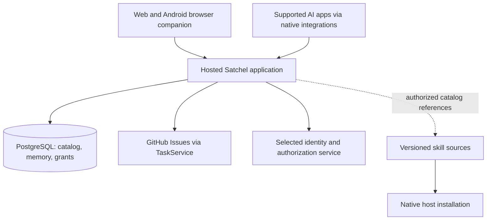

# Satchel: decisions and build roadmap

## Goal

Deliver a hosted companion and native AI integrations that let a person carry useful, explicitly saved context, projects, tasks, and reusable workflows between supported apps and devices.

This is a proposed roadmap and decision checklist, not a finalized stack, delivery commitment, or claim that integrations have been tested. It adds an implementation sequence to the existing product documents. It does not change agreed scope. Checklist completion means the named decision or evidence exists; it does not mean a mockup control has been built.

10 September clarification: start with a web companion, make sign-in simple (GitHub-first recommended), target a zero-cost personal pilot, and test native plugin hooks for context delivery. These supersede the earlier Android-packaging gate and Render-first hosting preference. See [D13–D16 and current findings](decisions.md). No hosting provider or authentication implementation has been selected.

## Where to start

**Implementation update, 11 September:** the web pilot uses React/Vite on Vercel and Supabase for auth/PostgreSQL. Native OAuth MCP and scoped explicit writes are implemented as Vercel Node functions; Fastify and a separate container were not needed. Both host packages are installed locally. [Agent setup](agent-setup.md) and [native runtime evidence](checkpoints/native-agent-pilot.md) supersede earlier unselected-provider and pending-integration statements below. The remaining tables retain the broader product roadmap, not a claim that all listed features exist.

Start with a small, real continuity experiment. Save a project decision in one connected AI app, retrieve it in a fresh conversation in another, correct it through Satchel on a phone, and retrieve the corrected version. Run the service independently of the laptop. Then revoke one connection and verify it loses access.

This proves the product's central value and exposes the most consequential uncertainties: platform access, authentication, retrieval behavior, and memory correctness. A complete dashboard would not answer those questions.

We should settle enough to build this experiment, then make larger commitments from its results. We do not need every commercial or future extension decision resolved before writing code.

## Context & Decisions

| Position | Status | Source |
|---|---|---|
| Continuity, hosted service, companion interface, native AI integrations | Agreed direction | [Product](product.md), [D02–D04](decisions.md) |
| Explicit saves and corrections; no personas or initial curator | Agreed boundary | [D05–D06](decisions.md) |
| GitHub Issues is the V1 task authority; Satchel task-source plugins come later | Agreed boundary | [D07–D08](decisions.md), [Task model](tasks-and-handoffs.md) |
| Preserve the visual direction, implement both themes, vet broad visual changes | Agreed boundary | [D09–D11](decisions.md), [Design review](../design/review-notes.md) |
| Projects, skills, installation and access are distinct concepts | Working model to specify | [Projects](projects.md), [Skills](skills-and-plugins.md) |
| TypeScript, React, one backend and PostgreSQL | New recommendation for evaluation | Stack rationale below; not a user-approved selection |
| Web companion first; native Android deferred | Agreed initial scope | [D13](decisions.md) |

## Proposed starting stack

I recommend one code repository, one small application service, and one managed database for the first deployable version. The reasons are a shared implementation language, a small operating burden, and a direct path to exercising real clients. These are engineering judgments, not results of a vendor benchmark.

| Layer | Starting recommendation | What we must settle or prove |
|---|---|---|
| Language/tooling | TypeScript throughout the application; supported Node.js release; one package manager and lockfile | Pin compatible versions, including the MCP SDK, when scaffolding |
| Companion | React + Vite, responsive layouts, installable web app where supported | Actual Android install, authentication return, draft handling and accessibility; [Vite supports a React/TypeScript starting template](https://vite.dev/guide/) |
| UI implementation | Reusable components and CSS design tokens derived from the existing visual direction | Accessible primitives, final component choices, full light/dark behavior; framework defaults do not establish the design |
| Backend | Node.js + Fastify; HTTP API and remote MCP transport calling the same application services | SDK/framework fit, request limits, connection lifecycle and host compatibility; [Fastify documentation](https://fastify.dev/docs/latest/) |
| Canonical application data | Managed PostgreSQL for accounts, grants, project catalog, explicit memory and revisions, skill references | Validate the schema, access isolation, correction transactions, deletion and restoration before adopting it |
| Retrieval | Scoped lookups and PostgreSQL full-text search as the first measured baseline | Recall for ordinary language; introduce semantic retrieval only if measured misses justify it; [PostgreSQL text search](https://www.postgresql.org/docs/current/textsearch-intro.html) |
| Identity | Established authentication implementation plus a compatible OAuth authorization server for AI connections | Select a provider/library only after the MCP authorization experiment; website login alone does not implement agent authorization |
| Tasks | Internal TaskService with a GitHub Issues implementation | GitHub App versus another supported authorization route; selected repositories, attributable writes and recovery |
| Skill sources | Versioned existing source repositories/packages; Satchel stores references and configuration intent | Private source access, install paths, version pinning and evidence per target |
| Hosting | Evaluate a complete free-tier deployment; Vercel and Firebase are candidates raised by the user | Web/API/MCP/auth/storage fit, usage limits, region, billing requirements and recovery; no purchase or deployment selected yet |
| Delivery | GitHub CI checks, reproducible container build, staging before production, separately versioned native packages | Release promotion, schema compatibility, rollback and plugin review/update delays |
| Operations | Structured operational logs, errors, latency/cost counters and backup/restore procedure | Redaction, retention, alerts and ownership; memory text is not default telemetry |

The earlier Render example supports Git-backed or Docker-image web deployments, private networking and managed PostgreSQL. It remains an architecture reference; the user's zero-cost pilot target now governs provider selection. A serverless free-tier deployment may change the proposed container/process layout. [Web services](https://render.com/docs/web-services), [PostgreSQL connections](https://render.com/docs/postgresql-creating-connecting).

**Storage recommendation:** use GitHub as the authority for tasks and versioned skill sources; evaluate PostgreSQL as the authority for memory and the catalog. My reasoning is that concurrent correction, scoped reads and explicit record lifecycle fit a transactional service well. Keep a readable export so portability does not depend on Git being the live database. This recommendation does not silently settle the earlier Git-backed-versus-hosted-memory debate; the storage decision must record its tradeoffs.

The initial memory loop should not require a separate model API or model-provider key from the user. Explicit records can be saved and queried by the host agent through tools. If retrieval later requires embeddings or another model service, decide cost, data flow and failure behavior before adding it. No extraction or curator service follows automatically from that choice.

### Deployment shape to evaluate

The application can initially serve the built web assets, `/api` and `/mcp` from one deployment. These paths are proposed. Keep business rules shared between the companion and tools. Add a separate worker or object store only when a required workload establishes the need. The diagram does not authorize arbitrary source fetching or remote skill execution.

The delivery path should be: local development with synthetic data → checks → staging deployment → real-client verification → versioned production release. Define a controlled database migration step and rollback procedure; restoring a database snapshot is not a normal application rollback because it can discard newer user writes. Staging and production need separate data and credentials.

## System decisions to work through

Each item needs a short written decision, an accountable owner when scheduled, and the evidence listed. Avoid turning every question into an abstraction or separate service.

| ID | Area | Questions to resolve | Required output / evidence |
|---|---|---|---|
| S01 | V1 contract | Who is the first user? Which everyday jobs must work? What counts as continuity? Which capabilities can wait? | A release scope with a few concrete scenarios, exclusions and success criteria |
| S02 | Platform support | Which exact Codex, ChatGPT, Claude Code and Claude chat surfaces? Desktop, CLI, browser, Android? Which account/policy requirements? | Capability matrix with evidence, dates and tested versions; unknown is an allowed state |
| S03 | Domain model | How do accounts, projects, repositories, memories, skill sources, installations, connections, tasks and handoffs relate? | Entity diagram and worked examples for a non-code project and a multi-repo project |
| S04 | Identity | How does a person sign up, recover access, link identities and use several devices? What happens with personal and work accounts? | Chosen login mechanism and account lifecycle; linking cannot silently merge private data |
| S05 | Agent authorization | Which app can read/write what? Are grants per connection or device? How do consent, expiry, refresh and revocation work? | Auth flow verified in two hosts; companion and agent permissions independently enforced |
| S06 | Storage and lifecycle | Which store owns each record? How do IDs, revisions, retries, conflicting changes, archive and deletion work? | Storage decision, schema, transaction examples and tested recovery/export format |
| S07 | Retrieval | How is a project selected? Which rules are always available? How are scope, relevance, freshness and token budget handled? | Context assembly contract and a small evaluation set including missed and irrelevant records |
| S08 | Memory writes | What counts as an explicit save? How does an agent show the statement and scope? How are duplicates and corrections handled? | Save/correct/forget contracts with provenance and acknowledgement; brainstorming does not become memory |
| S09 | API and MCP | Which minimal tools exist? How do errors, pagination, size limits, compatibility and retries work? | Versioned contracts and real tool traces, including denied and ambiguous requests |
| S10 | Task backend | Which issue operations and metadata are necessary? How do project routing, external edits and unavailable GitHub behave? | GitHub authorization decision, mapping document, adapter contract and failure tests |
| S11 | Skill delivery | Who owns each package? How is private content accessed? What gets installed on which machine, at what version and scope? | One instructions-only skill and one dependency-bearing skill installed and verified on appropriate targets |
| S12 | Deployment | Which provider, region, environments, domains, secrets and database plan? What runs while the laptop is off? | Reproducible staging deploy and a costed production proposal |
| S13 | Reliability | What latency/freshness targets? Which operations retry? Do webhook or indexing workloads need durable jobs? | Timeout/retry rules, stale-state UI and recovery tests; add jobs only for required workloads |
| S14 | Data protection | How are tenant/project boundaries enforced in queries, indexes and caches? What do logs, backups and exports contain? | Access tests, credential separation, log redaction, deletion/retention behavior and explicit hosting trust model |
| S15 | Engineering workflow | Repository layout, migrations, environments, fixture data, test coverage, dependency updates and release versions? | Repeatable setup, CI gates and compatible application/plugin releases |
| S16 | Operations and economics | Who handles failed connections, incidents and restores? What costs grow per user? What usage limits are enforced? | Operating runbook, restore drill, cost model and alerts that expose actionable failures |

For S02, create one row per actual surface, not just “Claude” or “OpenAI.” Record installation route, account prerequisites, read/write tools, skill access, script execution, fresh-chat retrieval, second-device behavior and known limitations. Test both direct tool requests and ordinary requests that should cause retrieval. A successful request from an API inspector establishes neither installed-plugin behavior nor phone availability.

For S05, distinguish three authorization relationships: a person signs into Satchel; an AI app receives access to Satchel; Satchel receives access to selected GitHub resources. Their tokens and revocation semantics must not be conflated. MCP's HTTP authorization specification describes discovery, client registration options and resource-bound tokens that need to fit the chosen implementation. [MCP authorization](https://modelcontextprotocol.io/specification/2025-11-25/basic/authorization).

For S10, evaluate a GitHub App first because GitHub documents targeted permissions and repository selection. Decide installation versus user-attributed operations from the actual task workflow. This does not require GitHub access merely to use memory. [GitHub Apps](https://docs.github.com/en/apps/creating-github-apps/about-creating-github-apps/about-creating-github-apps).

## User journey: download, install, onboard and use

The proposed hosted experience is: **open Satchel → sign in → save something useful → connect an AI app → prove it can retrieve it → add projects, tasks and skills as needed.** A hosted user should not have to deploy a server or configure a database.

Installation has three separate meanings:

| What the user gets | Proposed delivery | What it establishes |
|---|---|---|
| Satchel companion | A website on laptop and phone; optional home-screen installation where supported | Access to their account and configuration |
| Satchel integration in an AI app | The platform's supported plugin or connection setup | That host can discover authorized Satchel tools/workflows |
| A particular private or shared skill | A supported package installation into a named host/environment | The skill is available there; dependencies still determine what can run |

Do not require the third step to achieve the first useful memory handoff. Do not call an app “connected” just because the user downloaded a package.

### U01 — Discovery and expectations

- [ ] Explain the value with one cross-app example and a visible support matrix.
- [ ] Decide private invitations versus public signup for the pilot, and who receives access.
- [ ] Explain what is saved, who operates the service, and the difference between shared context and a copied conversation.
- [ ] Show account/platform prerequisites before the user spends time installing anything.

**Output:** landing/setup copy and a specific definition of the first useful result.

### U02 — Account setup and recovery

- [ ] Choose sign-in options, recovery, account deletion and account-switching behavior.
- [ ] Decide whether a new user starts with personal context only or is asked to create a project.
- [ ] Allow a memory-only start without connecting GitHub or installing a skill.
- [ ] Preserve progress if authorization opens another window, is declined, or expires.

**Output:** complete signup and recovery flows, including cancellation and empty states.

### U03 — First successful connection

- [ ] Let the user select an exact AI app and surface; show its supported setup steps.
- [ ] Explain requested access in product terms: which material can be read and which operations can change it.
- [ ] Verify a real read of a harmless setup record; verify an explicit write separately when write access is requested.
- [ ] Show “setup required,” “authorized,” “verified at …,” “expired,” or “unavailable” from evidence.
- [ ] Make a denied or unsupported setup recoverable without pretending it succeeded.

**Output:** per-platform onboarding guide plus repeatable connection verification.

OpenAI documents testing the MCP connection before the complete packaged plugin, with account/workspace-dependent developer mode and a public HTTPS endpoint for submission. Claude Code documents marketplace installation with user, project and local scopes. These are distinct flows; neither establishes every mobile surface. [OpenAI testing](https://developers.openai.com/plugins/deploy/connect-chatgpt), [Claude Code installation](https://code.claude.com/docs/en/discover-plugins).

### U04 — First project

- [ ] Choose required fields, naming, aliases, archive behavior and how ambiguity is resolved.
- [ ] Support a project with no repository and one with several repositories.
- [ ] Link resources deliberately; adding a URL must not silently ingest or authorize the source.
- [ ] Make task destination selection separate from code repository and native app project association.

**Output:** create/edit/archive flows and matching domain examples. See [Projects](projects.md).

### U05 — Daily memory use

- [ ] Design direct save, agent-mediated explicit save, search, inspect, correct and forget.
- [ ] Show the relevant scope, source and current revision without making routine use technical.
- [ ] Explain what to do when an agent fails to retrieve something, retrieves the wrong project, or cites stale context.
- [ ] Decide whether reminders of unsaved work are needed; do not introduce automatic capture through onboarding copy.

**Output:** ordinary and failure journeys tied to retrieval tests, not just CRUD screens.

### U06 — Tasks and handoffs

- [ ] Connect selected GitHub resources only when the user enables tasks.
- [ ] Define create/find/update/complete/reopen flows and deliberate project routing.
- [ ] Define a handoff that includes work completed, validation actually performed, blockers, next action and accessible code references.
- [ ] Use real destination links where available and a clear copy fallback elsewhere.
- [ ] Explain unavailable code and partial multi-repository completion; a handoff does not transfer local files.

**Output:** one real issue followed from initial work in one host to continuation in another. See [Tasks and handoffs](tasks-and-handoffs.md).

### U07 — Skills and sharing

- [ ] Define adding an existing source, selecting a version, installing to a target and resolving missing dependencies.
- [ ] Distinguish in-library, installed, authorized, unverified and runnable states.
- [ ] Define package sharing separately from access to personal memories and credentials.
- [ ] Decide update, rollback, removed-source and uninstall behavior without overwriting local changes silently.
- [ ] Explain phone limitations for local scripts and native desktop automation.

**Output:** two representative setup guides and evidence on a second machine. See [Skills and plugins](skills-and-plugins.md).

### U08 — Android and another device

- [ ] Test the responsive web companion in the user's actual Android browser.
- [ ] Keep native Android packaging deferred; evaluate home-screen installation only as an optional web enhancement.
- [ ] Test share-to-save, sign-in return, deep links, local drafts, app updates and logout data clearing.
- [ ] Decide which offline behavior is promised; pending local content must not display as remotely saved.
- [ ] Specify what a new laptop inherits and what must be installed or authorized again.

**Output:** web-on-phone acceptance results. Reopen Android packaging later only for a demonstrated requirement; it is not an initial release gate.

Web installation varies by platform/browser and is separate from app-store distribution. A web manifest and HTTPS are part of the installable-web route; neither proves offline synchronization or Android share-target behavior. [Installable web apps](https://developer.mozilla.org/en-US/docs/Web/Progressive_web_apps/Guides/Making_PWAs_installable).

### U09 — Control, troubleshooting and leaving

- [ ] Let the user inspect effective access for each connection and revoke it independently.
- [ ] Distinguish agent-access preview from deliberate manual export.
- [ ] Explain expired credentials, unreachable sources, failed writes and outdated packages with actionable next steps.
- [ ] Define export, account deletion, retention, device removal and how to leave without losing usable records.

**Output:** recovery/offboarding flows and a readable export opened outside Satchel.

### U10 — Design quality and usability

- [ ] Resolve navigation and information hierarchy against these workflows.
- [ ] Specify actual light/dark tokens, typography, controls, focus states and responsive layouts.
- [ ] Include keyboard/touch use, long names, many projects, empty/loading/error/offline states and large text.
- [ ] Research and obtain user vetting for broad visual changes before applying them across the app.

**Output:** reviewed screen/state specifications using the existing design direction. Existing mockup behavior remains illustrative.

## Release and product decisions

| ID | Area | What we must decide | When it blocks |
|---|---|---|---|
| R01 | Pilot and feedback | Who uses it first, which daily workflows, how feedback is collected, who fixes setup failures? | Before inviting pilot users |
| R02 | Distribution | Private plugin test path versus public listing; package ownership, release channels, signing/review requirements where applicable | Before promising an install path; public review should not block an eligible private experiment |
| R03 | Cost and business model | Hosting budget, per-user storage/API/support cost, limits, free/paid direction and whether billing is needed | Budget before deployment; billing before paid release, not the continuity experiment |
| R04 | Trust and public identity | Privacy/support pages, retention and operator access explanation, domain/name decision, source/package licenses | Before external release; private repo does not settle licensing or public branding |
| R05 | Migration | Which JEFF content to move, how to preserve provenance and active work, how gig maps to issues and when authority changes | Before moving live content or retiring JEFF components |
| R06 | Longer-term scope | Third-party task-source plugins, collaboration, self-hosting, broader mobile distribution | Revisit on demonstrated demand; no initial implementation implied |

The hosted search design must state who can read server-side data. Encryption in transit and at rest must not be described as end-to-end encryption. If a zero-knowledge requirement is introduced, reopen retrieval and hosting design before implementation proceeds on incompatible assumptions.

## Build sequence and deliverables

These phases express dependency order. Their checkboxes track future work; writing this roadmap does not complete them. `CURRENT` marks the proposed next item, not work already underway. Dates and effort estimates should follow the platform experiment and a known team/capacity.

### Phase 1: Define and test feasibility [IN PROGRESS]

- [x] 1.1 Choose the first app pair, actual devices and continuity scenarios: Codex, Claude Code and the web companion for the initial experiment.
- [ ] 1.2 Fill the support matrix from current documentation and account access; choose a bounded memory/project contract.
- [ ] **1.3 Build a throwaway or reusable authenticated service experiment with synthetic records and a provisional store; exercise consent, save, retrieve, correction and revocation.** ← CURRENT
- [ ] 1.4 Run fresh-chat tests across the two hosts and the phone companion with the laptop off; record failed ordinary retrieval separately from tool errors.
- [ ] 1.5 Record storage/auth/hosting choices from the results and define the first release contract.

**Deliverable:** working continuity demonstration, compatibility evidence, initial contracts and short architecture decisions. **Exit:** real cross-provider continuity, current corrections and enforced access. Phone companion success is recorded separately from native phone-chat success. If phone-chat access is unavailable, agree on the limited supported promise before broadening implementation.

11 September progress (`gig-27f1`, complete): the Vite/React companion is deployed on Vercel with Supabase Auth/PostgreSQL. Personal and project memory, browser CRUD, revision conflicts and isolation have been verified as recorded in the feature checkpoints. Production login, save, reload, detail retrieval and deletion passed; the user also confirmed phone sign-in and use. Native agent authorization, hooks and plugin continuity remain subsequent work. See the [hosted checkpoint](checkpoints/hosted-web-pilot.md) and [setup and implementation limits](development.md).

Named-memory follow-up (`gig-27f1.1`): name, description and optional More info replace the single text field. The pilot migration preserves existing text; summary-only listing and scoped name reads are implemented, with browser save/read/correction/deletion verification. The user requires hooks to load the authorized memory index and agents to fetch details by name as needed. Hook delivery, agent authorization, non-project scopes and cross-app verification remain pending. See [the updated memory contract](memory-and-storage.md).

11 September follow-up (`gig-27f1.3`): personal memory is now implemented as For me, without requiring or creating a project. Personal and project scopes share feature components and data-access operations; their names and reads remain separate. The fourth migration preserves project records and adds personal uniqueness. See [current checkpoint](checkpoints/web-memory-pilot-2.md). Deployment, repository scope and authorized hook/MCP integration remain pending.

### Phase 2: Build the durable service [PENDING]

- [ ] 2.1 Scaffold the selected stack and local/staging environments with repeatable setup and CI.
- [ ] 2.2 Implement account isolation, grants, project identities, memory revisions and shared HTTP/MCP application services.
- [ ] 2.3 Implement bounded retrieval, retry/concurrency handling, deletion and export/recovery.
- [ ] 2.4 Test access through search/caches, expired authorization, duplicate writes and restore behavior.

**Deliverable:** deployed private service and small functional inspection interface. **Exit:** durable records and recoverable failures, with no false save acknowledgements or cross-account access. A second synthetic account tests isolation even during a single-person pilot.

### Phase 3: Deliver the companion and supported integrations [PENDING]

- [ ] 3.1 Resolve the first-use flows and review necessary design changes with the user.
- [ ] 3.2 Implement responsive companion screens, both themes, onboarding, memory/project management and connection diagnostics.
- [ ] 3.3 Package and version the native integrations, document prerequisites and verify fresh installs.
- [ ] 3.4 Test web-on-phone delivery, new-device setup, recovery and offboarding.

**Deliverable:** usable private alpha: one companion, hosted service, and verified integration packages for the named hosts. **Exit:** a fresh user can achieve a cross-app save/retrieve/correct loop without developer intervention. Hosted alpha users do not deploy the backend.

### Phase 4: Add tasks and skill portability [PENDING]

- [ ] 4.1 Add GitHub authorization and the internal task adapter; verify issue operations and project destinations.
- [ ] 4.2 Implement portable handoffs and test continuation with accessible code across hosts.
- [ ] 4.3 Add skill source/catalog management and platform-specific installation guidance/status.
- [ ] 4.4 Verify private skill access, version changes and a dependency-bearing skill on a second machine.

**Deliverable:** feature-complete V1 candidate covering memory, projects, tasks, skills and connections. **Exit:** one ordinary project can continue across apps with current context, a real task and a usable workflow. The source-extension seam exists internally; no Satchel plugin loader or marketplace ships.

### Phase 5: Pilot, harden and migrate selectively [PENDING]

- [ ] 5.1 Use the product for real daily work and measure setup time, retrieval misses, stale context, failed saves and maintenance burden.
- [ ] 5.2 Complete release-relevant recovery, access, performance, accessibility and compatibility checks.
- [ ] 5.3 Validate selected JEFF imports and an explicit per-project task cutover with backups and source-ID mapping.
- [ ] 5.4 Fix evidence-backed problems and decide whether the product has earned wider release.

**Deliverable:** pilot report, operating runbook and migration evidence. **Exit:** reliable daily continuity and a recoverable service; existing JEFF components retire only after their replacements are proven. [Detailed acceptance scenarios](migration-and-validation.md).

### Phase 6: Release V1 [PENDING]

- [ ] 6.1 Finalize supported-surface documentation, onboarding/support content, budget/limits and public policies appropriate to the release.
- [ ] 6.2 Complete required native AI integration package distribution reviews; Android app-store distribution is deferred.
- [ ] 6.3 Release versioned service and integrations with monitoring, support ownership and rollback procedures.

**Deliverable:** a reachable product URL, repeatable installation routes, supported-device list, user documentation, export path and operating ownership. **Exit:** an eligible user can discover, install/connect, use, troubleshoot and leave Satchel through documented flows. Public listing or paid launch is a separate release choice.

## What to decide first, and what can wait

| Before the first experiment | Before the private alpha | Before wider release | Deferred unless required |
|---|---|---|---|
| First user jobs and app/device pair | Final storage and auth choices | Public distribution path | Satchel source-plugin SDK/loader |
| Minimal record/project contract | Full project/grant schema | Support and privacy documentation | Built-in Notion or other task adapters |
| Supported connection path | Correct/delete/export semantics | Cost limits and any billing | Collaborative memory/workspaces |
| Synthetic fixture and pass/fail tests | Reviewed first-use UX and both themes | Proven restore/incident process | Self-host installation product |
| Provisional auth/hosting under the zero-cost pilot target | Web-on-phone acceptance | Selected migration/cutover | Native Android packaging; remote execution and worker fleets |

The proposed first pair remains Codex and Claude Code on the laptop, plus Satchel in the phone browser. Initial companion delivery is now web-only. Next, verify hook-assisted retrieval and agent authorization against a complete free-tier deployment candidate. Direct phone-chat integration remains a later, separately tested capability.

This work creates a roadmap document only. No hosting resources, accounts, plugin installations, issue backlog, source migration or visual overhaul are performed by it. When implementation starts, use the existing task authority until a deliberate cutover; this document is not a second live task tracker.
