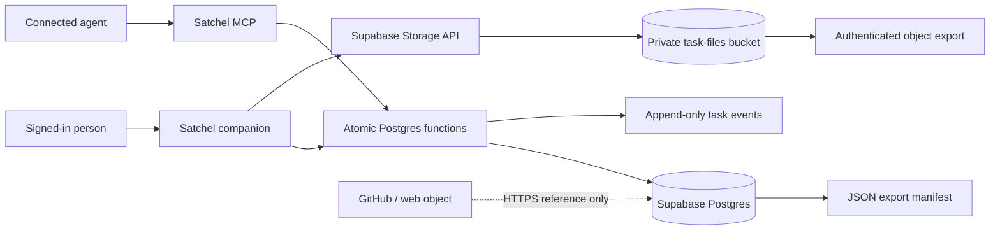
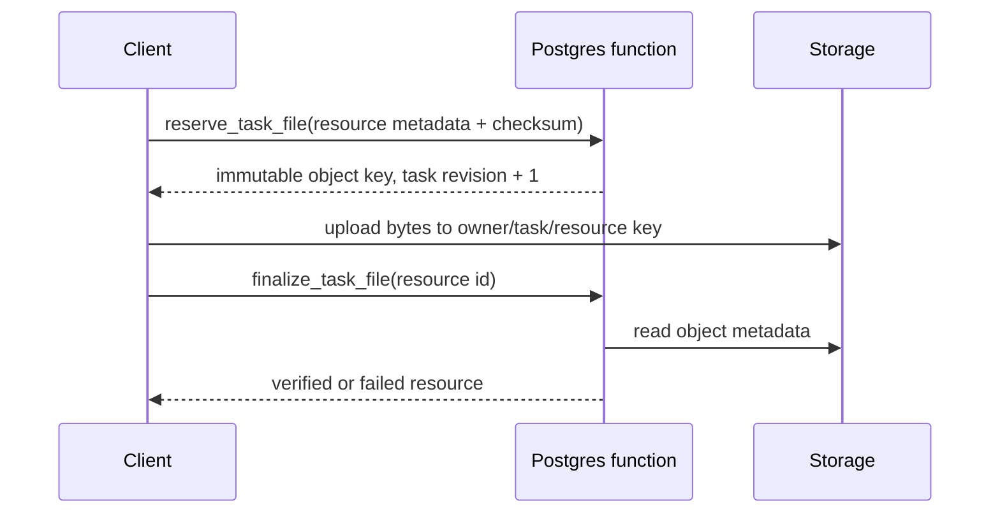

# Supabase-native task management LLD

16 September 2026. Approved implementation direction. This document replaces the earlier GitHub-Issues-backed design.

## Decision

Supabase Postgres is the sole authority for Satchel task content, state, revision, handoffs, resources and event history. A task belongs either to the owner's personal **For me** scope or to a Satchel project; neither scope requires a repository. GitHub issues, pull requests, repositories, documents and other web objects are typed resources attached to a task; Satchel never treats them as task identity and never fetches external URLs automatically.

Supabase Storage owns uploaded bytes. Postgres owns their metadata and lifecycle. Realtime is optional and not required for correctness.

## What the first slice solves

- Capture a personal or project task once and retrieve it in another supported agent or device.
- Make the current state, blocker, priority and next action explicit.
- Preserve append-only handoffs and meaningful state history.
- Attach HTTPS references and private files without coupling work to a code repository.
- Reject stale concurrent writes rather than silently overwriting them.
- Revoke agent access immediately through the existing grant generation.
- Export task records and the corresponding stored objects.

Out of scope for this slice: external tracker synchronization, task claims/leases, collaboration between owners, automatic URL fetching, public file URLs, cleanup scheduling and Realtime UI subscriptions. A bounded cleanup command is included; scheduling it is an operational choice.

## System view





Database writes are atomic with their events and idempotency receipt. Storage upload is deliberately a separate phase because object storage and Postgres cannot share one transaction.

## Relational model

### `tasks`

The canonical task row contains identity (`owner_id`, nullable `project_id`, `id`), content (`title`, `outcome`, `why`, `done_when[]`, `next_action`), planning (`status`, `priority`, `blocked_reason`), concurrency (`revision`) and audit fields (`created_by`, `updated_by`, timestamps). `project_id = null` is the personal **For me** scope.

States are `inbox`, `ready`, `in_progress`, `blocked`, and `done`. A blocked task requires a blocker; other states must not retain one. A done task requires `closed_at`; reopening clears it.

Every mutation supplies `expected_revision`. The update and revision increment occur in the same statement. A mismatch returns `PT409`.

### `task_handoffs`

Append-only structured evidence containing completed work, decisions, validation, remaining work, blockers, next action and summary. `supersedes_ids[]` corrects earlier handoffs without editing them. `record_task_handoff` updates the task next action/state and creates the handoff/event in one transaction, returning both the new task projection and handoff.

### `task_resources`

A constrained union:

- `external_url`: validated HTTPS URL, optional provider, no object fields, immediately `verified`.
- `storage_object`: immutable object key, original filename as metadata, media type, byte count, SHA-256 checksum and upload lifecycle. The first slice limits standard uploads to 6 MB; larger files require a later resumable-upload flow.

Lifecycle: `pending → verified`, or `pending → failed`; `deleted` is reserved for cleanup. The object key is `{owner_id}/{task_id}/{resource_id}` inside the private `task-files` bucket. The original filename never appears in the key.

### `handoff_resource_refs`

Many-to-many references from later handoffs to already verified task resources. A resource may also record the handoff that introduced it.

### `task_events`

Append-only audit records for create, content update, state change, handoff, resource addition, upload reservation, verification and failure. Meaningful task mutations write an event in the same transaction. Events contain compact details, not a duplicate task body.

### `task_write_requests`

Idempotency ledger keyed by `(owner_id, request_id)`. It stores operation, canonical JSONB payload hash, result identities, result revision and completion time. Retrying an identical committed request returns its result. Reusing the ID for another payload returns `PT409`.

### `agent_task_grants`

Per-project capability rows are bound to `(owner_id, client_id, grant_id)`, while `agent_connections.task_personal` grants the personal task scope. Capabilities are `can_read`, `can_write`, and `can_upload`. Personal task access is distinct from personal-memory access. The grant generation must match both the live connection and JWT. Reauthorization rotates the generation and replaces grants atomically; revocation deletes task grants and rotates the connection generation.

## Ownership invariants

Every child carries `owner_id`, nullable `project_id`, `task_id`, and an internal generated `scope_key`. The scope key is the project UUID text or `personal`, allowing null-safe composite foreign keys without a fake project:

```sql
unique (owner_id, scope_key, id)

foreign key (owner_id, scope_key, task_id)
  references tasks(owner_id, scope_key, id)
```

Handoff-resource references bind both sides to the same owner, scope and task. These constraints prevent a policy or wrapper defect from associating data across tenants, personal/project scopes or tasks.

## Authorization

All exposed tables have RLS enabled. The migration revokes defaults and grants only `SELECT` to `authenticated`; direct inserts, updates and deletes are unavailable. Mutations use narrowly scoped functions that derive the owner and actor from `auth.uid()` and trusted JWT claims.

`private.agent_can_access_tasks(project_id, capability)` is a stable `SECURITY DEFINER` boolean helper in an unexposed schema. A null project checks the explicit personal-task grant; a UUID checks its per-project grant. `authenticated` receives `USAGE` on `private` and `EXECUTE` only on the narrow helpers so RLS policies can call them. The helper always checks caller owner, client, current connection generation, JWT generation, revocation and exact-scope capability.

Companion sessions are identified by the absence of an OAuth `client_id`; agent sessions require exact task grants. Task permissions do not grant memory access, and memory permissions do not grant task access.

Storage policies allow insert only at a pre-reserved pending object key when the caller has upload capability, and authenticated download only for a verified resource when the caller has read capability. There is no overwrite, update, delete or public access.

Signed URLs are not used by the first slice. If added later, they must be short-lived and treated as bearer credentials that remain valid until expiry.

## Atomic operations

| Function | Result | Main guarantees |
|---|---|---|
| `create_task` | task | stable IDs, idempotency receipt, `created` event |
| `update_task` | task | expected revision, content event |
| `transition_task` | task | expected revision, state invariants, state event |
| `record_task_handoff` | `{task,handoff}` | same-task supersession/resources, task patch + append-only handoff + event |
| `add_task_resource` | `{task,resource}` | HTTPS only, no fetch, revision + event |
| `reserve_task_file` | `{task,resource}` | upload capability, immutable key, expected checksum/size |
| `finalize_task_file` | resource | checks Storage size/checksum, verified/failed event |
| `fail_task_file` | resource | records client upload failure |
| `export_tasks` | JSON manifest | RLS-scoped task, handoff, resource, reference and event records |

Each operation keeps its database transaction short and performs no external network call while holding a row lock.

## MCP contract

The production MCP server exposes:

- `list_tasks(project_id, statuses?)` (`null` means personal tasks)
- `read_task(project_id, id)`
- `create_task(request_id, id, project_id, …)`
- `update_task(request_id, id, project_id, revision, …)`
- `transition_task(request_id, id, project_id, revision, status, blocked_reason)`
- `record_handoff(request_id, handoff_id, id, project_id, revision, …)`
- `add_task_resource(request_id, resource_id, id, project_id, revision, label, url, …)`

Lists are bounded and return `complete`. Reads include handoffs, verified resources and events. Writes require explicit user intent, a stable request ID and the current revision. MCP stores external links but never downloads them. Binary file transfer remains a companion operation.

## Companion flow

1. Choose **For me** or a project; **For me** is available even with zero projects.
2. Capture a task with title, optional outcome and next action.
3. Open it to edit the full contract or transition state.
4. Attach an HTTPS reference or reserve/upload/verify a private file.
5. Record a handoff; this advances the task revision atomically.
6. Export the selected personal/project scope manifest and every verified stored object.

Agent consent presents memory scopes and task scopes separately. Task write and upload are independent checkboxes.

## Storage provisioning and recovery

The `task-files` bucket must be created as private through the Supabase Storage API or Dashboard; the database migration installs its object policies when the hosted Storage schema is present. Do not create or mutate Storage metadata rows directly.

Database backups do not contain Storage bytes. A recoverable backup consists of:

1. `export_tasks` JSON preserving identities, checksums and object keys;
2. authenticated downloads of every verified `storage_object` in the manifest;
3. a restore drill that recreates private objects at their immutable keys and then restores database records.

The companion's selected-scope export performs steps 1 and 2. `npm run task-storage:cleanup` removes failed or pending reservations older than 24 hours and records deletion events; scheduling it is operational follow-up, not hidden inside request transactions.

## Failure behavior

- `42501`: caller or capability is unauthorized.
- `P0002`: task is missing or intentionally indistinguishable from unavailable.
- `PT409`: revision mismatch, idempotency mismatch, or invalid upload phase.
- `23514`: field, state, supersession or resource invariant failed.
- Lost response: retry the same request ID and identical payload.
- Upload failure: mark the reservation failed; never invent a verified resource.
- Verification mismatch: persist `failed` with a diagnostic event.
- External URL unavailable: the reference remains; Satchel does not fetch or mirror it.

## Verification gates

- Apply every migration to the local PostgreSQL harness and hosted Supabase project.
- Assert companion, read-only agent, writer, uploader, stale generation, revoked generation and cross-owner cases.
- Assert every meaningful mutation creates exactly one event and identical retries do not duplicate rows.
- Assert stale revisions preserve the winning task.
- Assert composite foreign keys reject cross-owner, cross-project and personal/project child rows.
- Assert unsafe/non-HTTPS external URLs fail.
- Assert upload paths contain only owner/task/resource IDs and failed verification never becomes readable.
- Run `supabase test db`, security/performance advisors, the Node test suite and production build.
- Browser-check capture, edit, transition, block, handoff, link, upload, download, export and reconnect consent.

## Implementation slices

1. **Core data and authorization** — schema, composite constraints, RLS, capability grants, atomic functions, events and tests.
2. **Agent continuity** — TaskService plus MCP list/read/write/handoff/link tools.
3. **Companion workflow** — personal/project task lists, capture/detail/transitions/handoffs/resources/export.
4. **Storage operations** — private bucket provisioning, upload verification, abandoned-upload cleanup, restore drill.
5. **Release hardening** — hosted migration, advisors, browser evidence, observability and rollback/export runbook.

Slices are deployable checkpoints, not alternate designs. A slice is complete only when its contract and denial paths are tested.

## Current implementation checkpoint

Slices 1–3 and the provisioning/cleanup/export mechanics for slice 4 are implemented. The hosted migrations and private bucket are live; hosted rollback-only project and personal-agent RPC smokes pass, task-table advisor findings are clear, and the production companion renders both **For me** and project task scopes. Cleanup scheduling, a restore drill and broader signed-in browser mutation evidence remain release-hardening work.

## Sources

- [Supabase Row Level Security](https://supabase.com/docs/guides/database/postgres/row-level-security)
- [Supabase Storage access control](https://supabase.com/docs/guides/storage/security/access-control)
- [Supabase standard uploads](https://supabase.com/docs/guides/storage/uploads/standard-uploads)
- [Supabase Data API exposure change](https://supabase.com/changelog/45329-breaking-change-tables-not-exposed-to-data-and-graphql-api-automatically)
